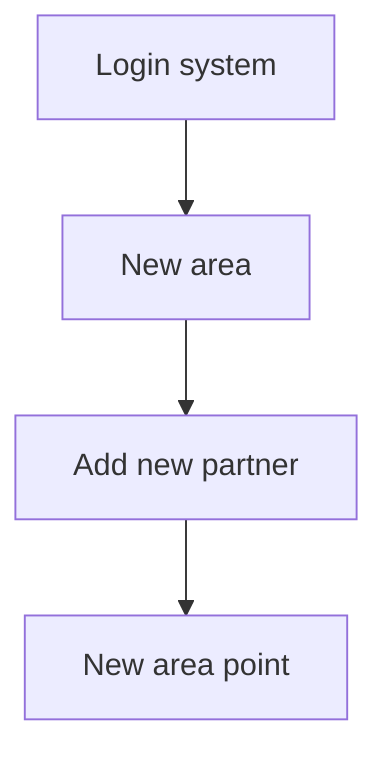
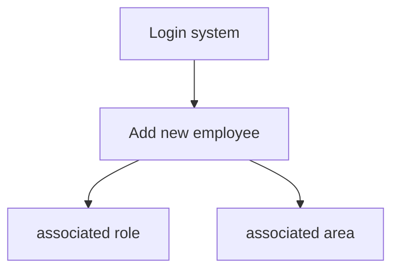
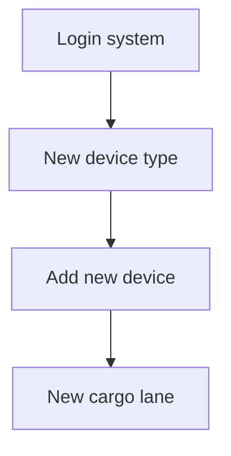
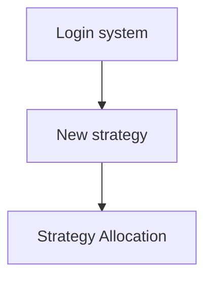

#Project introduction

## Introduction to vending machines

> Dikode is a `smart vending machine operation management system` based on the concept of `Internet of Things`

### Internet of Things

The Internet of Things (IoT: Internet of Things), simply put, allows various items to be connected through the Internet to realize the exchange and communication of information.

This concept may sound a bit abstract, but we can think of it as a super large social network. However, the members of this network are not humans, but various objects. For example, your refrigerator, washing machine, and even your car can all exchange information with each other through the Internet, just like they are chatting themselves.

The amazing thing about the Internet of Things is that it can make these things smarter. They are able to sense their surroundings and react automatically according to the situation. For example, if your home is equipped with a smart home system, when you are on your way home from work, the air conditioner in your home can be turned on in advance and automatically adjusted to your preferred temperature, so that you can feel a comfortable environment as soon as you return home.

In general, real objects are endowed with the capabilities of perception, communication and intelligence, providing people with a more intelligent and convenient living and working environment.

Application scenarios: smart home, shared charging, smart vending machine

### Vending machine

In recent years, contactless smart vending machines have gradually become the preferred shopping method for young consumers. Not only are these devices widely distributed in public places such as parks, subway stations, and shopping malls, providing customers with great shopping convenience, but they are also regarded by many e-commerce companies as an emerging blue ocean market due to their low operating costs and high profit margins.

Compared with traditional vending machines, the advantage of smart vending machines lies in their self-management capabilities, which are as follows:

- **Internet of Things Technology**: Like the ears and clairvoyance of vending machines. No matter where the vending machine is, managers can know its status through computers or mobile phones, such as which products are almost sold out and which need to be replenished.
- **Smart Analysis and Recommendation**: A smart vending machine is like an invisible smart head that can analyze customers' preferences and recommend products that may make you excited. It's like having a considerate little assistant who can always help you find what you want most.
- **Personnel and equipment binding management**: Each vending machine has its own exclusive "bodyguard". Once there is a problem with the vending machine, these "bodyguards" can appear immediately to solve the problem quickly and keep the vending machine in the best condition.
- **Mobile Payment Support**: Who carries cash with them when they go out these days? Smart vending machines support various mobile payment methods. Scan and pay, which is convenient and safe, making the shopping experience smoother.
- **Online and offline integration (OMO)**: Smart vending machines can also perfectly combine online and offline. Customers can browse products online and then purchase them directly at the vending machine, or after seeing the products they like on the vending machine, place an order directly online.

A smart vending machine is not just a vending machine, it is more like an intelligent system that can manage and optimize itself. It makes operations more efficient and the shopping experience more personalized, while also bringing innovation and development to the retail industry.

## Vending machine terminology

**Regional Management**: In order to conduct operation and management more efficiently, the company divides the operation scope into several logical areas. The division of these areas is based on business needs and may be different from geographical administrative areas to ensure more reasonable resource allocation and more efficient operational management.

> *Annotation: An image illustrating image-20240514214806291*

**Point selection**: Point refers to the specific location of the smart vending machine. When selecting locations, we will consider factors such as foot traffic, target customer groups, visibility, and convenience to maximize the efficiency of the vending machine and the customer's purchasing experience.


> *Annotation: An image showing application details*

**Vending machine function**: A smart vending machine is like an automatic shop, filled with various products. Customers can choose what they want directly on the machine, and then the machine will deliver the goods to them, just like an automated warehouse.

> *Annotation: An image showing application details*

**Aisle design**: The aisle inside the vending machine can be imagined as the kind of shelves in a supermarket. Each floor has several places where products can be placed, so that many different products can be placed, and many can be placed on each floor, so customers will have more choices.


> *Annotation: An image showing application details* 
> *Annotation: An image showing application details*


## Roles and functions

A complete vending machine system consists of five terminals and five roles:

1. Administrator: Manage basic data (regions, points, equipment, cargo lanes, commodities, etc.), create work orders to assign maintenance or operations personnel, view orders, and view various statistical reports.

2. Operation and maintenance personnel: placing equipment, removing equipment, and repairing equipment.

3. Operation staff: replenishment.

4. Partners: Only provide spots and reap the benefits.
5. Consumers: Place an order to purchase goods on the mini program or on the screen.


> *Annotation: An image illustrating image-20240515095146017*


## Business process

Throughout the project, the main core business will be implemented in the course, which mainly includes the following business processes:

(1) **Platform Administrator**: The main role is to manage basic data and create work orders to exclude employees from completing maintenance or replenishment.

(2) **Operation staff**: The main role is to handle operation work orders (replenishment and other operations)

(3) **Operation and maintenance personnel**: The main role is to handle operation and maintenance work orders (equipment maintenance and other operations)

(4) **Consumer**: For use by C-end users. Consumers can open this terminal by scanning the QR code on the vending machine. The main function is to complete the shopping operation at the vending machine.


> *Annotation: An image illustrating main process*

### Platform Administrator


> *Annotation: An image showing application details*


> *Annotation: An image illustrating 1677120654314*

The brief process in the picture above:

①: Platform managers log in to the system management backend system

②: Create regional data

③: Create point data under the area

④: Add operation and maintenance/operation personnel

⑤: Create vending machine information

⑥: Set vending machine location information

⑦: Create an operation and maintenance delivery work order, and the operation and maintenance personnel will start placing equipment (installing equipment)

⑧: Set the product information for sale

⑨: Create an operation replenishment work order, and the operation staff will start posting product information

### Operation and maintenance personnel


> *Annotation: An image illustrating 1677120732660*

The brief process in the picture above:

①: Operation and maintenance personnel log in to the operation system through the App

②: Process the dispatched work orders in the App

③: After accepting the work order, install the vending machine at the designated delivery point

④: Reject the work order and end the work order for the operation and maintenance personnel.

### Operations staff


> *Annotation: An image illustrating 1677120750585*

The brief process in the picture above:

①: Operation personnel log in to the operation system through the App

②: Process the dispatched work orders in the App

③: After accepting the work order, replenish the goods in the designated vending machine.

④: Reject the work order and end the work order for the operation and maintenance personnel.

### Consumer


The brief process in the picture above:

Method one:

①: Users purchase goods through the vending machine QR code

②: After scanning the QR code, select the product in the WeChat applet on the mobile phone

③: Pick up the goods at the vending machine after successful payment

Method two:

①: The user selects products on the vending machine

②: After selecting the product, scan the QR code to pay for the product.

③: Pick up the goods at the vending machine after successful payment

## Product prototype

Click the link to view the CODE project immediately https://codesign.qq.com/s/426304924036117


> *Annotation: An image illustrating image-20240521112225505*

## Library table design

System background basic data table relationship description:


> *Annotation: An image illustrating the relevant interface/process*

An area can have multiple points

One location can have multiple vending machines

A vending machine has multiple aisles

The same product can be placed in multiple aisles

There are multiple products under one product type

There are multiple vending machines under one vending machine type

A partner has multiple locations

There is no relationship between partners and regions, because multiple locations owned by partners can be distributed in different regions

Each area has multiple operation and maintenance personnel, who are responsible for the operation, maintenance and operation of the equipment in this area.


#Initial AI

## AIGC

AI: Artificial intelligence is a discipline under the computer science system and refers to a technology that simulates human intelligence through computer systems. 

Simply put, AI is a technology that simulates human intelligence. It uses algorithms such as machine learning and deep learning to equip computers with the ability to analyze, understand, reason and make decisions on data.

We can think of "artificial intelligence" as a smart robot companion that not only learns automatically, but can also think and make decisions like a human brain. In daily life, it can help us solve many problems, such as predicting the weather conditions of the day before going out, recommending the best driving route for the car by analyzing traffic conditions, etc.


AIGC (AI Generated Content): AIGC is an application branch in the AI ​​field, focusing on using AI technology to automatically generate content, including text, code, pictures, audio, and video.


> *Annotation: An image illustrating image-20240603213733977*

AI large model: usually refers to a deep learning model with a large number of parameters, an artificial intelligence system trained with a large amount of data and equipped with complex computing capabilities. They can perform a variety of advanced tasks, including content generation.


> *Annotation: An image illustrating image-20240603213714790*


Common general large model products:

| Countries | Conversation Products | Large Models | Links |
| ---- | ------------------ | --------------- | ------------------------------- |
| United States | OpenAI ChatGPT | GPT-3.5, GPT-4 | https://chat.openai.com/ |
| United States | Microsoft Copilot | GPT-4 and unknown | https://copilot.microsoft.com/ |
| United States | Google Bard | Gemini | https://bard.google.com/ |
| China | Baidu Wenxin Yiyan | Wenxin 4.0 | https://yiyan.baidu.com/ |
| China | iFlytek Spark | Spark 3.5 | https://xinghuo.xfyun.cn/ |
| China | Zhipu Qingyan | GLM-4 | https://chatglm.cn/ |
| China | The Dark Side of the Moon Kimi Chat | Moonshot | https://kimi.moonshot.cn/ |
| China | MiniMax Hoshino | abab6 | https://www.xingyeai.com/ |
| China | Tongyi Qianwen | Qwen-Max | https://tongyi.aliyun.com/ |

## Prompt project

### What is Prompt?

Prompts are questions we ask of large models.

To give the simplest example, many students will ask the AI ​​"who are you" when they use it for the first time. The question "who are you" is the prompt.


> *Annotation: An image illustrating image-20240603161534054*


### Why study?
When communicating with AI, we often find that direct questions may not yield satisfactory answers.

But if we ask questions in a different way, or provide some additional contextual information, the AI's performance will be greatly improved.


> *Annotation: An image illustrating image-20240603160705373*

Using different prompts for the same question may result in different answers. How to train a smart AI assistant?

At this time, the prompt project comes in handy. Through carefully designed prompts, we can guide the AI ​​model to make its output more accurate, relevant and useful.


### What is a prompt project?

Prompt Engineering, also known as contextual prompts, involves designing and optimizing input text, also known as prompts, to guide the AI ​​model to generate the expected output.

To put it simply, it is like asking AI a good question and letting it give us a satisfactory answer.


> *Annotation: An image illustrating image-20240603213651549*


### Composition of Prompt

- **Role**: Define a role for the AI that best matches the task, such as: "You are a software engineer" "You are a primary school teacher"
- **Instructions**: Describe the task
- **Context**: Give other background information related to the task (especially in multi-turn interactions)
- **Example**: Give examples when necessary, [Practice has proven that it is helpful for the correctness of the output]
- **Input**: input information for the task; clearly identify the input in the prompt word
- **Output**: The format description of the output, so that subsequent modules can automatically parse the output results of the model, such as (JSON, Java)

> Defining the role first is actually to narrow the problem domain at the beginning and reduce ambiguity.

**Case:**

```markdown
Role: You are a professional blogger.

Instructions: Write an article about the latest AI technology developments.

Context: Articles should cover the current state and future trends of AI technology.

Examples: You can cite recent AI technology breakthroughs and insights from industry experts.

Input: Relevant information and data about current AI technology.

Output: A draft article with a clear structure and a clear point of view.
```


```markdown
Role: You are a senior Java development engineer.

Instructions: Write a Java function that takes two integer arguments and returns their sum.

Context: This function will be used in a simple math application that helps students practice basic arithmetic operations.

Example: If you call the function `addNumbers(3, 5)`, it should return `8`.

Input: Two integer parameters, `int a` and `int b`.

Output: Returns the sum of these two integers, of type `int`.
```


### Common programming related prompts

#### Table structure

```markdown
You are a software engineer, help me generate the MySQL table structure
The requirements are as follows:
	1. Course management table, table name tb_course, fields include primary key id, course code, course subject, course name, course price, applicable group, course introduction
Other requirements:
    1. Each table has fields such as creation time (create_time), modification time (date_time), creator (create_by), modifier (update_by), and remark (remark).
    2. The primary key of each table is auto-incrementing.
    3. The course price is an integer and the course code is a string.
    4. Please add a comment for each field
    5. Help me insert some IT course sample data into the generated table.
        Course subjects: Java, artificial intelligence, big data
        Applicable people: novice students, intermediate programmers
```


#### Generate database documentation

```markdown
You are a software engineer. Now you need to write a database description document based on the SQL script of the database. The SQL script is as follows:
CREATE TABLE `tb_course` (
    `id` INT AUTO_INCREMENT COMMENT 'Primary key ID',
    `course_code` VARCHAR(255) NOT NULL COMMENT 'course code',
    `course_subject` VARCHAR(100) NOT NULL COMMENT 'course subject',
    `course_name` VARCHAR(255) NOT NULL COMMENT 'course name',
    `course_price` INT COMMENT 'course price',
    `target_audience` VARCHAR(100) COMMENT 'Applicable crowd',
`course_introduction` TEXT COMMENT 'course introduction',
    `create_time` DATETIME COMMENT 'Creation time',
    `update_time` DATETIME COMMENT 'modification time',
    `create_by` VARCHAR(64) COMMENT 'Creator',
    `update_by` VARCHAR(64) COMMENT 'Modifier',
    `remark` VARCHAR(255) COMMENT 'remark',
    PRIMARY KEY (`id`)
) ENGINE=InnoDB DEFAULT CHARSET=utf8mb4 COMMENT='Course Management Table';

The output requirements are:
	1. Each table and the fields of each table must be described in detail, including field names, types, and functions.
	2. Use markdown output format, and field descriptions need to be displayed in tables.
	3. If there is a relationship between the tables, the relationship between the tables needs to be clearly described.
```

#### Generate code

Code generation is a relatively conventional solution and is used more often. It is divided into several situations.

- Give table generation code (common in projects)
  - Given the ddl of the table structure, all the codes for the addition, deletion, modification and query of the table can be output
  - Provides a dll with a table structure and can output interface documents for addition, deletion, modification and query
-Complete code
  - Example 1-given the entity class to help write getters, setters, toString, constructors, etc.
  - Example 2 - Give a controller to help write swagger annotations, etc.
- Extract structure (no value, time-consuming programming)
  - Example 1-Extract dto class or vo class based on interface document

#### Generate code flow chart

There are some relatively complex business processes that often require drawing flow charts. Now we can use AI to help us draw flow charts.

```java
You are a software engineer. In order to facilitate the understanding of the code execution process, you need to provide a flow chart of the code execution. The code is as follows:
    //Create a work order
    @Transactional
    @Override
    public int insertTaskDto(TaskDto taskDto) {
    //1. Check whether the vending machine exists
    VendingMachine vm = vendingMachineService.selectVendingMachineByInnerCode(taskDto.getInnerCode());
    if (vm == null) {
        throw new ServiceException("Device does not exist");
    }
    //2. Verify whether the vending machine status matches the work order type
    checkCreateTask(vm.getVmStatus(), taskDto.getProductTypeId());
    //3. Verify whether there is an unfinished work order of the same type for this device. If it exists, it cannot be created.
    hasTask(taskDto.getInnerCode(), taskDto.getProductTypeId());
    //4. Verify whether the employee exists
    Emp emp = empService.selectEmpById(taskDto.getUserId());
    if (emp == null) {
        throw new ServiceException("Employee does not exist");
    }
    // 5. Verify that workers in different areas cannot accept work orders
    if (emp.getRegionId() != vm.getRegionId()) {
        throw new ServiceException("Staff in different regions cannot accept work orders");
    }
    //6. Save work order information
    Task task = new Task();
    BeanUtil.copyProperties(taskDto, task);//Property assignment
    task.setCreateTime(DateUtils.getNowDate());//Creation time
    task.setTaskCode(generateTaskCode());//Work order number 202405150001
    task.setTaskStatus(DkdContants.TASK_STATUS_CREATE);//Create a work order
    task.setAddr(vm.getAddr());
    task.setRegionId(vm.getRegionId());
    task.setUserName(emp.getUserName());
int taskResult = taskMapper.insertTask(task);
    //7. If it is a replenishment work order, insert a record into the work order details table
    if (task.getProductTypeId() == DkdContants.TASK_TYPE_SUPPLY) {
        if (CollUtil.isEmpty(taskDto.getDetails())) {
            throw new ServiceException("Replenishment work order details cannot be empty");
        }
        List<TaskDetails> taskDetailsList = taskDto.getDetails().stream().map(details -> {
            TaskDetails taskDetails = BeanUtil.copyProperties(details, TaskDetails.class);
            taskDetails.setTaskId(task.getTaskId());
            return taskDetails;
        }).collect(Collectors.toList());
        taskDetailsService.insertBatch(taskDetailsList);
    }

    return taskResult;
}

Output: Please use mermaid language to describe the process of this method
```


```mermaid
graph TD;
    A[Query vending machine] --> B(Vending machine does not exist?)
    B -- Yes --> C [Exception thrown: Device does not exist]
    B -- No --> D [Verify vending machine status and work order type]
    D --> E (verification failed?)
    E -- Yes --> F[throws exception]
    E -- No --> G [Check uncompleted work orders of the same type]
    G --> H (Is there an uncompleted work order of the same type?)
    H -- Yes --> I[throws exception]
    H -- No --> J[query employees]
    J --> K (employee does not exist?)
    K -- Yes --> L[Exception thrown: Employee does not exist]
    K -- No --> M [Verify whether the employee area is consistent with the vending machine area]
    M --> N (inconsistent?)
    N -- Yes --> O[Exception thrown: Workers in non-same area cannot accept work orders]
    N -- No --> P[Save work order information]
    P --> Q(Save successfully?)
    Q -- No --> R[Failed to process save]
    Q -- Yes --> S (The work order type is replenishment?)
    S -- Yes --> T[Processing replenishment work order details]
    T --> U[Replenishment details processing results?]
    U -- Failure --> V [Exception thrown: Replenishment work order details cannot be empty]
    U -- Success --> END
    S -- No --> END
```


# Project construction

## Build backend project

### Initialize project

#### Git download

Clone the source code through idea, warehouse address: https://gitee.com/ys-gitee/dkd-parent.git


> *Annotation: An image illustrating image-20240520214059378*

#### Maven build

After opening the project using idea, wait for the environment check (mainly Maven downloading project dependencies)


> *Annotation: An image illustrating image-20240520214558738*

### MySQL related

#### Import sql

1. Create database `create schema dkd;`

2. Execute the sql script file in the figure below to complete the import.


> *Annotation: An image illustrating image-20240604091257616*


#### Configuration information
Under the `dkd-admin` module, edit `application-druid.yml` in the `resources` directory and modify the database connection.


> *Annotation: An image illustrating image-20240520215400124*

### Redis related

#### Start

In the redis decompression directory, edit the `redis.windows.conf` configuration file and set the redis password.

> Setting a Redis password is to enhance data security, prevent unauthorized access and protect critical information, thereby ensuring application stability and compliance.


> *Annotation: An image illustrating image-20240520215706631*

In the redis decompression directory, execute `redis-server.exe redis.windows.conf` to start


> *Annotation: An image illustrating image-20240407114209508*

#### Configuration information

Under the `dkd-admin` module, `application.yml` in the `resources` directory, set the redis password and other related information


> *Annotation: An image illustrating image-20240520215922159*

### Project running

Under the `dkd-admin` module, run `com.ruoyi.DkdApplication.java`. If the following picture appears, it means the startup is successful.


> *Annotation: An image illustrating image-20240520220411801*

If the backend runs successfully, it can be accessed through ([http://localhost:8080]), but the static page will not appear. You can continue to refer to the following steps to deploy the frontend, and then access it through the frontend address.

## Build front-end project

### Initialize project

Clone the source code through vscode, warehouse address: https://gitee.com/ys-gitee/dkd-vue.git


> *Annotation: An image illustrating image-20240520221244465*

### Install dependencies

```shell
# Install dependencies
npm install
```


> *Annotation: An image illustrating image-20240520221730103*

### Project running

```shell
# Start service
npm rundev
```


> *Annotation: An image illustrating image-20240520221915801*


Open the browser and enter: ([http://localhost:80) Default account/password `admin/admin123`) If the login page can be displayed correctly and you can log in successfully, and the menu and page are displayed normally, it indicates that the environment has been set up successfully.


> *Annotation: An image illustrating image-20240520222338910*


#Point management

## Requirements description
**Business Scenario**: Suppose our company now has a grand plan - to develop business in Beijing. First, we need to identify several potential areas, which may be commercial areas or residential areas with large flow of people and high consumption power. Then, we have to negotiate with potential partners in these areas, such as managers or owners of shopping malls, office buildings, schools, etc.

Once we reach an agreement with our partners and determine the details and points of cooperation, we can arrange staff to launch the smart vending machines. These points will become the "home" of our smart vending machines, providing consumers with convenient purchasing services.


Point management mainly involves three functional modules, and the business process is as follows:

1. **Login system**: Backend managers log in to the backend system
2. **New area**: Backend managers can add area ranges, which are linked to operation and maintenance/maintenance personnel, and points can be associated under the area.
3. **Add a new partner**: Managers can add partners, and partners can be associated with points.
4. **Add regional points**: Backend managers can add new points in specific areas. These points are the specific locations where smart vending machines are placed.




> *Annotation: An image illustrating image-20240520200927616*


## Library table design

```markdown
You are a software engineer, help me generate the table structure of MySQL
The requirements are as follows:
1. Region table, table name tb_region, fields include primary key id, region name
2. Partner table, table name tb_partner, fields include primary key id, partner name, contact person, contact number, share ratio (int type), account number, password
3. Point table, table name tb_node, fields include primary key id, point name, detailed address, business district type (int type)
Other requirements:
1. Each table has fields such as creation time (create_time), modification time (date_time), creator (create_by), modifier (update_by), and remark (remark).
2. The primary key of each table is auto-incrementing.
3. There is a one-to-many relationship between regions and points, and a one-to-many relationship between partners and points. Please use fields to express it and establish foreign key constraints.
4. Please add comments to all fields
5. Help me insert some test data of Beijing city-related regions, points, and partners into the generated table.
```

```sql
CREATE TABLE `tb_region` (
  `id` INT AUTO_INCREMENT COMMENT 'primary key id' PRIMARY KEY,
  `region_name` VARCHAR(255) NOT NULL COMMENT 'region name',
  `create_time` TIMESTAMP DEFAULT CURRENT_TIMESTAMP COMMENT 'Creation time',
  `update_time` TIMESTAMP DEFAULT CURRENT_TIMESTAMP ON UPDATE CURRENT_TIMESTAMP COMMENT 'modification time',
  `create_by` VARCHAR(64) COMMENT 'Creator',
  `update_by` VARCHAR(64) COMMENT 'Modifier',
  `remark` TEXT COMMENT 'note'
) ENGINE=InnoDB DEFAULT CHARSET=utf8mb4 COMMENT='Region Table';

--Insert test data
INSERT INTO `tb_region` (`region_name`,`remark`) VALUES ('Chaoyang District, Beijing City','Chaoyang District, Beijing City'), ('Haidian District, Beijing City','Haidian District, Beijing City'), ('Dongcheng District, Beijing City','Dongcheng District, Beijing City');

CREATE TABLE `tb_partner` (
  `id` INT AUTO_INCREMENT COMMENT 'primary key id' PRIMARY KEY,
  `partner_name` VARCHAR(255) NOT NULL COMMENT 'Partner name',
  `contact_person` VARCHAR(64) COMMENT 'Contact',
  `contact_phone` VARCHAR(15) COMMENT 'Contact number',
  `profit_ratio` INT COMMENT 'Sharing ratio',
  `account` VARCHAR(64) COMMENT 'Account',
  `password` VARCHAR(64) COMMENT 'password',
`create_time` TIMESTAMP DEFAULT CURRENT_TIMESTAMP COMMENT 'Creation time',
  `update_time` TIMESTAMP DEFAULT CURRENT_TIMESTAMP ON UPDATE CURRENT_TIMESTAMP COMMENT 'modification time',
  `create_by` VARCHAR(64) COMMENT 'Creator',
  `update_by` VARCHAR(64) COMMENT 'Modifier',
  `remark` TEXT COMMENT 'note'
) ENGINE=InnoDB DEFAULT CHARSET=utf8mb4 COMMENT='Partner Table';

-- Insert test data
INSERT INTO `tb_partner` (`partner_name`, `contact_person`, `contact_phone`, `profit_ratio`, `account`, `password`) VALUES
('Partner A', 'Zhang San', '13800138000', 30, 'a001', 'pwdA'),
('Partner B', 'Li Si', '13912345678', 25, 'b002', 'pwdB');

CREATE TABLE `tb_node` (
  `id` INT AUTO_INCREMENT COMMENT 'primary key id' PRIMARY KEY,
  `node_name` VARCHAR(255) NOT NULL COMMENT 'Point name',
  `address` VARCHAR(255) NOT NULL COMMENT 'Detailed address',
  `business_type` INT COMMENT 'Business district type',
  `region_id` INT COMMENT 'Region ID',
  `partner_id` INT COMMENT 'Partner ID',
  `create_time` TIMESTAMP DEFAULT CURRENT_TIMESTAMP COMMENT 'Creation time',
  `update_time` TIMESTAMP DEFAULT CURRENT_TIMESTAMP ON UPDATE CURRENT_TIMESTAMP COMMENT 'modification time',
  `create_by` VARCHAR(64) COMMENT 'Creator',
  `update_by` VARCHAR(64) COMMENT 'Modifier',
  `remark` TEXT COMMENT 'note',
  FOREIGN KEY (`region_id`) REFERENCES `tb_region`(`id`) ON DELETE CASCADE ON UPDATE CASCADE,
  FOREIGN KEY (`partner_id`) REFERENCES `tb_partner`(`id`) ON DELETE CASCADE ON UPDATE CASCADE
) ENGINE=InnoDB DEFAULT CHARSET=utf8mb4 COMMENT='Point table';


-- Insert test data
-- Assume that the area ID is 1 corresponding to 'Chaoyang District, Beijing', and the partner ID is 1 corresponding to 'Partner A'
INSERT INTO `tb_node` (`node_name`, `address`, `business_type`, `region_id`, `partner_id`) VALUES
('Sanlitun point', 'Sanlitun Road, Chaoyang District, Beijing', 1, 1, 1),
('Wudaokou point', 'Wudaokou, Haidian District, Beijing', 2, 2, 2);
```


For the point management data model, the following is a schematic diagram:

-Relationship fields: region_id, partner_id

- Data dictionary: business_type 
> *Annotation: An image illustrating image-20240527171905791*

  
> *Annotation: An image illustrating image-20240604212450821*

## Generate basic code

### Requirements

Use the Ruoyi code generator to generate the front-end and back-end basic codes for regional management, partner management, and point management, and import them into the project:

> *Annotation: An image illustrating image-20240520191900302*


### Steps

#### ①Create directory menu

Create point management directory menu


> *Annotation: An image illustrating image-20240520192424147* 
> *Annotation: An image illustrating image-20240520192424147*

#### ②Add data dictionary

First create the dictionary type of `Business District`

 
> *Annotation: An image illustrating image-20240521094532290*


> *Annotation: An image illustrating image-20240521094625483*

Create the dictionary data of `Business District` again


> *Annotation: An image illustrating image-20240521094714656*


> *Annotation: An image illustrating image-20240521094828280*

#### ③Configure code generation information

Import three tables


> *Annotation: An image illustrating image-20240521095341985*


Configure partner table (reference prototype)


> *Annotation: An image illustrating image-20240520195705524*


> *Annotation: An image illustrating image-20240605101454103*


> *Annotation: An image illustrating image-20240521100933980*

Configure area table (reference prototype)


> *Annotation: An image illustrating image-20240521100154862*


> *Annotation: An image illustrating image-20240605101338740*


> *Annotation: An image illustrating image-20240521101741695*

Configure point table (reference prototype)


> *Annotation: An image illustrating image-20240520200439529*


> *Annotation: An image illustrating image-20240605101546273*


> *Annotation: An image illustrating image-20240521100818303*

#### ④Download the code and import the project

Select three tables to generate downloads


> *Annotation: An image illustrating image-20240521101119476*

Unzip `ruoyi.zip` to get the front-end and back-end code and dynamic menu sql


> *Annotation: An image illustrating image-20240521101354165*

Code import


> *Annotation: An image illustrating image-20240521121836288* 
> *Annotation: An image illustrating image-20240521121935608*

Adjust the display order of secondary menus


> *Annotation: An image illustrating image-20240521101613667*


## Regional management transformation

### Basic page

#### Requirements

Refer to the page prototype to complete the basic layout display transformation


> *Annotation: An image illustrating image-20240521122929449*

#### Code implementation

Modify in region/index.vue view component

```vue
<!-- Area list -->
<el-table v-loading="loading" :data="regionList" @selection-change="handleSelectionChange">
    <el-table-column type="selection" width="55" align="center" />
    <el-table-column label="serial number" type="index" width="50" align="center" prop="id" />
    <el-table-column label="region name" align="center" prop="regionName" />
    <el-table-column label="Remarks" align="center" prop="remark" />
    <el-table-column label="Operation" align="center" class-name="small-padding fixed-width">
        <template #default="scope">
		<el-button link type="primary" @click="handleUpdate(scope.row)" v-hasPermi="['manage:region:edit']">Edit</el-button>
<el-button link type="primary" @click="handleDelete(scope.row)" v-hasPermi="['manage:region:remove']">Delete</el-button>
        </template>
    </el-table-column>
</el-table>
```


### Area list

#### Requirements

In the area list query, the number of points in each area needs to be displayed


> *Annotation: An image illustrating the relevant interface/process*


#### Implementation ideas

There are many options to implement this function:

**(1) Synchronous storage:** There is a field with the number of points in the area table. When the point changes, the number of points in the area table is synchronized.

- Advantages: Since it is a single table query operation, querying the list is the most efficient.
- Disadvantages: The data in the area table needs to be modified when adding, deleting or modifying points, which involves additional overhead and the data may be inconsistent.

**(2) Related query: **Write related query statements and encapsulate them in the mapper layer.

- Advantages: Real-time query, 100% correct data, no need for separate maintenance.
- Disadvantages: SQL statements are complex, and if the amount of data is large, performance is relatively low.

The number of records in the area and point tables is not very large, so we use the correlation query scheme.


> *Annotation: An image illustrating image-20240605165826567*

####SQL

SQL query: first aggregate and count the number of points in each area, and then perform associated queries with the area table

```sql
-- Traditional mode
-- 1. First aggregate and count the number of points in each area
-- Determine query table tb_node
-- Determine the grouping field region_id
select region_id,count(*) as node_count from tb_node group by region_id;
-- 2. Then perform a related query with the regional table
select r.id,r.region_name,r.remark,ifnull(n.node_count,0) as node_count from tb_region r
    left join (select region_id,count(*) as node_count from tb_node group by region_id) n on r.id=n.region_id;

-- AI-assisted programming mode
-- Query all the information in the area table and need to display the number of points in each area.
SELECT r.*, COUNT(n.id) AS node_count FROM tb_region r LEFT JOIN tb_node n ON r.id = n.region_id GROUP BY r.id;
```

#### RegionVo

Create RegionVo based on interface document and sql


> *Annotation: An image illustrating image-20240521125020524*

#### RegionMapper

```java
/**
 * Query regional management list
 * @param region
 * @return RegionVo collection
 */
public List<RegionVo> selectRegionVoList(Region region);
```

#### RegionMapper.xml

```xml
<select id="selectRegionVoList" resultType="com.dkd.manage.domain.vo.RegionVo">
select r.id,r.region_name,r.remark,ifnull(n.node_count,0) as node_count from tb_region r
    left join (select region_id,count(*) as node_count from tb_node group by region_id) n on r.id=n.region_id
    <where>
<if test="regionName != null and regionName != ''"> and r.region_name like concat('%', #{regionName}, '%')</if>
    </where>
</select>
```

#### mybatis-config.xml


> *Annotation: An image illustrating image-20240521131706554*

#### IRegionService

```java
/**
 * Query regional management list
 * @param region
 * @return RegionVo collection
 */
public List<RegionVo> selectRegionVoList(Region region);
```

#### RegionServiceImpl

```java
/**
 * Query regional management list
 * @param region
 * @return RegionVo collection
 */
@Override
public List<RegionVo> selectRegionVoList(Region region) {
    return regionMapper.selectRegionVoList(region);
}
```

#### RegionController

```java
/**
 * Query regional management list
 */
@PreAuthorize("@ss.hasPermi('manage:region:list')")
@GetMapping("/list")
public TableDataInfo list(Region region)
{
    startPage();
    List<RegionVo> voList = regionService.selectRegionVoList(region);
    return getDataTable(voList);
}
```

#### region/index.vue

```vue
<!-- Area list -->
<el-table v-loading="loading" :data="regionList" @selection-change="handleSelectionChange">
  <el-table-column type="selection" width="55" align="center" />
  <el-table-column label="serial number" type="index" width="50" align="center" prop="id" />
  <el-table-column label="region name" align="center" prop="regionName" />
  <el-table-column label="Number of points" align="center" prop="nodeCount" />
  <el-table-column label="Remarks" align="center" prop="remark" />
  <el-table-column label="Operation" align="center" class-name="small-padding fixed-width">
    <template #default="scope">
      <el-button link type="primary" @click="handleUpdate(scope.row)" v-hasPermi="['manage:region:edit']">Edit</el-button>
      <el-button link type="primary" @click="handleDelete(scope.row)" v-hasPermi="['manage:region:remove']">Delete</el-button>
    </template>
  </el-table-column>
</el-table>
```


## Partner management transformation

### Basic page

#### Requirements

Refer to the page prototype to complete the basic layout display transformation


> *Annotation: An image illustrating image-20240521134037713*


#### Code implementation

In partner/index.vue view component

```vue
<!-- Search area -->
<el-form :model="queryParams" ref="queryRef" :inline="true" v-show="showSearch" label-width="90px">
    <el-form-item label="Partner name" prop="name">
        <el-input
                  v-model="queryParams.partnerName" placeholder="Please enter the partner name"
                  clearable @keyup.enter="handleQuery"/>
    </el-form-item>
    <el-form-item>
        <el-button type="primary" icon="Search" @click="handleQuery">Search</el-button>
        <el-button icon="Refresh" @click="resetQuery">Reset</el-button>
    </el-form-item>
</el-form>


<!-- Partner list -->
<el-table v-loading="loading" :data="partnerList" @selection-change="handleSelectionChange">
  <el-table-column type="selection" width="55" align="center" />
  <el-table-column label="serial number" type="index" width="50" align="center" prop="id" />
  <el-table-column label="Partner Name" align="center" prop="partnerName" />
  <el-table-column label="account" align="center" prop="account" />
  <el-table-column label="Sharing ratio" align="center" prop="profitRatio" >
    <template #default="scope">{{scope.row.profitRatio}}%</template>
  </el-table-column>
  <el-table-column label="Contact" align="center" prop="contactPerson" />
  <el-table-column label="Contact Phone" align="center" prop="contactPhone" />
  <el-table-column label="Operation" align="center" class-name="small-padding fixed-width">
    <template #default="scope">
      <el-button link type="primary" @click="handleUpdate(scope.row)" v-hasPermi="['manage:partner:edit']">Edit</el-button>
      <el-button link type="primary" @click="handleDelete(scope.row)" v-hasPermi="['manage:partner:remove']">Delete</el-button>
    </template>
  </el-table-column>
</el-table>

<!-- Add or modify partner management dialog box -->
<el-dialog :title="title" v-model="open" width="500px" append-to-body>
  <el-form ref="partnerRef" :model="form" :rules="rules" label-width="100px">
    <el-form-item label="Partner Name" prop="partnerName">
<el-input v-model="form.partnerName" placeholder="Please enter the partner name" />
    </el-form-item>
    <el-form-item label="Contact" prop="contactPerson">
      <el-input v-model="form.contactPerson" placeholder="Please enter the contact person" />
    </el-form-item>
    <el-form-item label="Contact Phone" prop="contactPhone">
      <el-input v-model="form.contactPhone" placeholder="Please enter your contact number" />
    </el-form-item>
    <el-form-item label="Creation time" prop="contactPhone" v-if="form.id!=null">
      {{form.createTime}}
    </el-form-item>
    <el-form-item label="Sharing Ratio" prop="profitRatio">
      <el-input v-model="form.profitRatio" placeholder="Please enter the profit ratio" />
    </el-form-item>
    <el-form-item label="Account" prop="account" v-if="form.id==null">
      <el-input v-model="form.account" placeholder="Please enter your account number" />
    </el-form-item>
    <el-form-item label="password" prop="password" v-if="form.id==null">
      <el-input v-model="form.password" type="password" placeholder="Please enter password" />
    </el-form-item>
  </el-form>
  <template #footer>
    <div class="dialog-footer">
      <el-button type="primary" @click="submitForm">Confirm</el-button>
      <el-button @click="cancel">Cancel</el-button>
    </div>
  </template>
</el-dialog>
</div>
</template>
```

Modify in the new method of PartnerServiceImpl

```java
/**
 * Add new partners
 *
 * @param partner partner
 * @return result
 */
@Override
public int insertPartner(Partner partner) {
    // Use the SecurityUtil tool class to encrypt the password
    partner.setPassword(SecurityUtils.encryptPassword(partner.getPassword()));
    partner.setCreateTime(DateUtils.getNowDate());
    return partnerMapper.insertPartner(partner);
}
```


### View details

In partner/index.vue view component

```vue
<el-button link type="primary" @click="getPartnerInfo(scope.row)" v-hasPermi="['manage:partner:query']">View details</el-button>


<!-- View partner details -->
<el-dialog title="Partner details" v-model="partnerInfoOpen" width="500px" append-to-body>
    <el-row>
        <el-col :span="12">Partner name: {{ form.partnerName }}</el-col>
        <el-col :span="12">Contact person: {{ form.contactPerson }}</el-col>
    </el-row>
    <el-row>
<el-col :span="12">Contact number: {{ form.contactPhone }}</el-col>
        <el-col :span="12">Sharing ratio: {{ form.profitRatio }}%</el-col>
    </el-row>
</el-dialog>

<script>
    /* View partner details */
    const partnerInfoOpen = ref(false);
    function getPartnerInfo(row) {
        reset();
        const _id = row.id;
        getPartner(_id).then(response => {
            form.value = response.data;
            partnerInfoOpen.value = true;
        });
    }
</script>
```


```vue
<!-- View Partner Details Dialog Box -->
<el-dialog title="Partner details" v-model="partnerInfoOpen" width="500px" append-to-body>
    <!-- Use the el-descriptions component to display information in the form of cards, which is neater -->
    <el-descriptions :column="2" border>
        <el-descriptions-item label="Partner name">{{ form.partnerName }}</el-descriptions-item>
        <el-descriptions-item label="Contact">{{ form.contactPerson }}</el-descriptions-item>
        <el-descriptions-item label="Contact Phone">{{ form.contactPhone }}</el-descriptions-item>
        <el-descriptions-item label="Sharing ratio">{{ form.profitRatio }}%</el-descriptions-item>
    </el-descriptions>
</el-dialog>
```


### Partner list

#### Implementation ideas

Implemented in the same way as the area list.


> *Annotation: An image illustrating image-20240607111610267*

####SQL

SQL query: first aggregate and count the number of points of each partner, and then perform related queries with the partner table

```sql
-- Traditional mode
-- 1. First aggregate and count the number of points of each partner
-- Determine the query table tb_node
-- Determine the grouping field partner_id
SELECT partner_id, COUNT(1) AS node_count from tb_node group by partner_id;
-- 2. Then perform related query with the partner table
select tp.*,ifnull(tn.node_count,0) from tb_partner tp
left join (SELECT partner_id, COUNT(1) AS node_count from tb_node group by partner_id) tn on tn.partner_id = tp.id;
```


```sql
-- AI-assisted programming mode
-- You are a software development engineer. Now you need to query and display all the field information of the partner table according to the sql script of the database, and at the same time display the number of points for each partner. The sql script is as follows
create table tb_node
(
    id int auto_increment comment 'primary key id'
        primary key,
    node_name varchar(255) not null comment 'point name',
    address varchar(255) not null comment 'detailed address',
business_type int null comment 'business district type',
    region_id int null comment 'region ID',
    partner_id int null comment 'Partner ID',
    create_time timestamp default CURRENT_TIMESTAMP null comment 'Creation time',
    update_time timestamp default CURRENT_TIMESTAMP null on update CURRENT_TIMESTAMP comment 'modification time',
    create_by varchar(64) null comment 'Creator',
    update_by varchar(64) null comment 'modifier',
    remark text null comment 'note',
    constraint tb_node_ibfk_1
        foreign key (region_id) references tb_region (id)
            on update cascade on delete cascade,
    constraint tb_node_ibfk_2
        foreign key (partner_id) references tb_partner (id)
            on update cascade on delete cascade
)
    comment 'Point table';
    
create table tb_partner
(
    id int auto_increment comment 'primary key id'
        primary key,
    partner_name varchar(255) not null comment 'Partner name',
    contact_person varchar(64) null comment 'Contact',
    contact_phone varchar(15) null comment 'Contact number',
    profit_ratio int null comment 'share ratio',
    account varchar(64) null comment 'account',
    password varchar(64) null comment 'password',
    create_time timestamp default CURRENT_TIMESTAMP null comment 'Creation time',
    update_time timestamp default CURRENT_TIMESTAMP null on update CURRENT_TIMESTAMP comment 'modification time',
    create_by varchar(64) null comment 'Creator',
    update_by varchar(64) null comment 'modifier',
    remark text null comment 'note'
)
    comment 'Partner list';
```


#### PartnerVo

Create PartnerVo based on interface document and sql

> *Annotation: An image illustrating image-20240524173300573*

#### PartnerMapper

```java
/**
 * Query partner management list
 * @param partner
 * @return partnerVo collection
 */
public List<PartnerVo> selectPartnerVoList(Partner partner);
```

#### PartnerMapper.xml

```xml
<select id="selectPartnerVoList" resultType="com.dkd.manage.domain.vo.PartnerVo">
    SELECT p.*, COUNT(n.id) AS node_count FROM tb_partner p
    LEFT JOIN tb_node n ON p.id = n.partner_id
    <where>
        <if test="partnerName != null and partnerName != ''">and partner_name like concat('%', #{partnerName},'%')
        </if>
    </where>
    GROUP BY p.id
</select>
```

#### IPartnerService

```java
/**
 * Query partner management list
 * @param partner
 * @return partnerVo collection
 */
public List<PartnerVo> selectPartnerVoList(Partner partner);
```

#### PartnerServiceImpl

```java
/**
 * Query partner management list
 * @param partner
 * @return partnerVo collection
 */
@Override
public List<PartnerVo> selectPartnerVoList(Partner partner) {
    return partnerMapper.selectPartnerVoList(partner);
}
```

#### PartnerController

```java
/**
 * Query partner management list
 */
@PreAuthorize("@ss.hasPermi('manage:partner:list')")
@GetMapping("/list")
public TableDataInfo list(Partner partner) {
    startPage();
    List<PartnerVo> voList = partnerService.selectPartnerVoList(partner);
    return getDataTable(voList);
}
```

#### region/index.vue

```vue
<!-- Partner list -->
<el-table v-loading="loading" :data="partnerList" @selection-change="handleSelectionChange">
    <el-table-column type="selection" width="55" align="center" />
    <el-table-column label="serial number" type="index" width="50" align="center" prop="id" />
    <el-table-column label="Partner Name" align="center" prop="partnerName" />
    <el-table-column label="Number of points" align="center" prop="nodeCount" />
    <el-table-column label="account" align="center" prop="account" />
    <el-table-column label="Sharing ratio" align="center" prop="profitRatio" >
<template #default="scope">{{ scope.row.profitRatio }}%</template>
    </el-table-column>
    <el-table-column label="Contact" align="center" prop="contactPerson" />
    <el-table-column label="Contact Phone" align="center" prop="contactPhone" />
    <el-table-column label="Operation" align="center" class-name="small-padding fixed-width">
        <template #default="scope">
            <el-button link type="primary" @click="getParnterInfo(scope.row)" v-hasPermi="['manage:partner:query']">View details</el-button>
            <el-button link type="primary" @click="handleUpdate(scope.row)" v-hasPermi="['manage:partner:edit']">Edit</el-button>
            <el-button link type="primary" @click="handleDelete(scope.row)" v-hasPermi="['manage:partner:remove']">Delete</el-button>
        </template>
    </el-table-column>
</el-table>
```


### Reset password

#### Backend part

In PartnerController

```java
/**
 *Reset partner password
 */
@PreAuthorize("@ss.hasPermi('manage:partner:edit')")
@Log(title = "Reset Partner Password", businessType = BusinessType.UPDATE)
@PutMapping("/resetPwd/{id}")
public AjaxResult resetpwd(@PathVariable Long id) {//1. Receive parameters
    //2. Create partner object
    Partner partner = new Partner();
    partner.setId(id);//Set id
    partner.setPassword(SecurityUtils.encryptPassword("123456"));//Set the encrypted initial password
    //3. Call service to update password
    return toAjax(partnerService.updatePartner(partner));
}
```

#### Front-end part

In manage/partner.js request api

```js
//Reset partner password
export function resetPartnerPwd(id){
  return request({
    url: '/manage/partner/resetPwd/' + id,
    method: 'put'
  })
}
```


In partner/index.vue view component

```vue
<el-table-column label="Operation" align="center" class-name="small-padding fixed-width" width="300px">
    <template #default="scope">
		<el-button link type="primary" @click="resetPwd(scope.row)" v-hasPermi="['manage:partner:edit']">Reset password</el-button>
    </template>
</el-table-column>

<script>
    import { listPartner, getPartner, delPartner, addPartner, updatePartner,resetPartnerPwd } from "@/api/manage/partner";
    /* Reset partner password */
function resetPwd(row) {
        proxy.$modal.confirm('Are you sure you want to reset this partner's password?').then(function () {
            return resetPartnerPwd(row.id);
        }).then(() => {
            proxy.$modal.msgSuccess("Reset successful");
        }).catch(() => { });
    }
</script>
```


## Point management transformation

### Basic page

#### Requirements

Refer to the page prototype to complete the basic layout display transformation


> *Annotation: An image illustrating image-20240521160012649*

#### Code implementation

In node/index.vue view component

```vue
<!-- Search area -->
<el-form :model="queryParams" ref="queryRef" :inline="true" v-show="showSearch" label-width="68px">
    <el-form-item label="Point name" prop="nodeName">
        <el-input v-model="queryParams.nodeName" placeholder="Please enter the point name" clearable @keyup.enter="handleQuery" />
    </el-form-item>
    <el-form-item label="Region Search" prop="regionId">
        <!-- <el-input v-model="queryParams.regionId" placeholder="Please enter the region ID" clearable @keyup.enter="handleQuery" /> -->
        <el-select v-model="queryParams.regionId" placeholder="Please select region" clearable>
            <el-option v-for="item in regionList" :key="item.id" :label="item.regionName" :value="item.id"></el-option>
        </el-select>
    </el-form-item>
    <el-form-item>
        <el-button type="primary" icon="Search" @click="handleQuery">Search</el-button>
        <el-button icon="Refresh" @click="resetQuery">Reset</el-button>
    </el-form-item>
</el-form>

<!-- Point list -->
<el-table v-loading="loading" :data="nodeList" @selection-change="handleSelectionChange">
    <el-table-column type="selection" width="55" align="center" />
    <el-table-column label="serial number" type="index" width="50" align="center" prop="id" />
    <el-table-column label="Point name" align="center" prop="nodeName" />
    <el-table-column label="regionID" align="center" prop="regionId" />
    <el-table-column label="Business District Type" align="center" prop="businessType">
        <template #default="scope">
<dict-tag :options="business_type" :value="scope.row.businessType" />
        </template>
    </el-table-column>
<el-table-column label="Partner ID" align="center" prop="partnerId" />
    <el-table-column label="Detailed address" align="center" prop="address" show-overflow-tooltip/>
    <el-table-column label="Operation" align="center" class-name="small-padding fixed-width">
        <template #default="scope">
<el-button link type="primary" icon="Edit" @click="handleUpdate(scope.row)" v-hasPermi="['manage:node:edit']">Edit</el-button>
<el-button link type="primary" icon="Delete" @click="handleDelete(scope.row)" v-hasPermi="['manage:node:remove']">Delete</el-button>
        </template>
    </el-table-column>
</el-table>

<!-- Add or modify point management dialog box -->
<el-dialog :title="title" v-model="open" width="500px" append-to-body>
  <el-form ref="nodeRef" :model="form" :rules="rules" label-width="100px">
    <el-form-item label="Point name" prop="nodeName">
      <el-input v-model="form.nodeName" placeholder="Please enter the point name" />
    </el-form-item>
    <el-form-item label="Region" prop="regionId">
      <!-- <el-input v-model="form.regionId" placeholder="Please enter the region ID" /> -->
        <el-select v-model="form.regionId" placeholder="Please select a region" clearable>
        <el-option v-for="item in regionList" :key="item.id" :label="item.regionName" :value="item.id"></el-option>
      </el-select>
    </el-form-item>
    <el-form-item label="Business District Type" prop="businessType">
      <el-select v-model="form.businessType" placeholder="Please select the business district type">
        <el-option v-for="dict in business_type" :key="dict.value" :label="dict.label"
          :value="parseInt(dict.value)"></el-option>
      </el-select>
    </el-form-item>
    <el-form-item label="Attribution partner" prop="partnerId">
      <!-- <el-input v-model="form.partnerId" placeholder="Please enter partner ID" /> -->
        <el-select v-model="form.partnerId" placeholder="Please select a partner" clearable>
        <el-option v-for="item in partnerList" :key="item.id" :label="item.partnerName" :value="item.id"></el-option>
      </el-select>
    </el-form-item>
    <el-form-item label="Detailed address" prop="address">
<el-input type="textarea" v-model="form.address" placeholder="Please enter detailed address" />
    </el-form-item>
  </el-form>
  <template #footer>
    <div class="dialog-footer">
      <el-button type="primary" @click="submitForm">Confirm</el-button>
      <el-button @click="cancel">Cancel</el-button>
    </div>
  </template>
</el-dialog>

<script setup name="Node">
    import { listPartner } from "@/api/manage/partner";
    import { listRegion } from "@/api/manage/region";
    import { loadAllParams } from "@/api/page";

    /* Query all condition objects */
    /* const loadAllParams = reactive({
      pageNum: 1,
      pageSize: 10000,
    }); */

    /* Query the list of partners */
    const partnerList = ref([]);
    function getPartnerList() {
        listPartner(loadAllParams).then(response => {
            partnerList.value = response.rows;
        });
    }
    getPartnerList();
    /* Query area list */
    const regionList = ref([]);
    function getRegionList() {
        listRegion(loadAllParams).then(response => {
            regionList.value = response.rows;
        });
    }
    getRegionList();

</script>
```

In api/page.js, extract all the conditions of a query

```js
export const loadAllParams = reactive({
  pageNum: 1,
  pageSize: 10000,
});
```


### Point list

#### Requirements

In the area details, the number of devices at each point needs to be displayed


> *Annotation: An image illustrating image-20240521164650187*

In point list query, information such as area, business district, etc. will be displayed in association with


> *Annotation: An image illustrating image-20240521164640411*


#### Implementation ideas

**Associated query**: For statistics on the number of devices, we need to perform associated queries and encapsulate them in the mapper layer.

**Related entities**: For region and partner data, we will use the nested query function provided by Mybatis.

MyBatis nested query is to split the joint query statement in the original multi-table query into a single table query, and then use mybatis syntax to nest them together. Nested queries are implemented by defining the `association` or `collection` elements in the `resultMap` and `sql` statements.


> *Annotation: An image illustrating image-20240609225517037*

Import the `dkd.sql` business table in the data into the development database


> *Annotation: An image illustrating image-20240612174727308* 
> *Annotation: An image illustrating image-20240612174906586*


####SQL

```sql
-- AI-assisted programming mode
-- You are a software development engineer. Now you need to query and display all field information of the point table according to the sql script of the database, and at the same time display the number of devices at each point. The sql script is as follows:
create table tb_node
(
    id int auto_increment comment 'primary key id'
        primary key,
    node_name varchar(255) not null comment 'point name',
    address varchar(255) not null comment 'detailed address',
    business_type int null comment 'business district type',
    region_id int null comment 'region ID',
    partner_id int null comment 'Partner ID',
    create_time timestamp default CURRENT_TIMESTAMP null comment 'Creation time',
    update_time timestamp default CURRENT_TIMESTAMP null on update CURRENT_TIMESTAMP comment 'modification time',
    create_by varchar(64) null comment 'Creator',
    update_by varchar(64) null comment 'modifier',
    remark text null comment 'note',
    constraint tb_node_ibfk_1
        foreign key (region_id) references tb_region (id)
            on update cascade on delete cascade,
    constraint tb_node_ibfk_2
        foreign key (partner_id) references tb_partner (id)
            on update cascade on delete cascade
)
    comment 'Point table';
    
create table tb_vending_machine
(
    id bigint auto_increment comment 'primary key'
        primary key,
    inner_code varchar(15) default '000' null comment 'device number',
    channel_max_capacity int null comment 'Device capacity',
    node_id int not null comment 'PointId',
    addr varchar(100) null comment 'Detailed address',
last_supply_time datetime default '2000-01-01 00:00:00' not null comment 'Last replenishment time',
    business_type int not null comment 'business district type',
    region_id int not null comment 'regionId',
    partner_id int not null comment 'PartnerId',
    vm_type_id int default 0 not null comment 'device model',
    vm_status int default 0 not null comment 'Equipment status, 0: not released; 1-operation; 3-decommissioning',
    running_status varchar(100) null comment 'Running status',
    longitudes double default 0 null comment 'longitude',
    latitude double default 0 null comment 'dimension',
    client_id varchar(50) null comment 'Client connection ID, used for emq authentication',
    policy_id bigint null comment 'policyid',
    create_time timestamp default CURRENT_TIMESTAMP not null comment 'Creation time',
    update_time timestamp default CURRENT_TIMESTAMP null comment 'modification time',
    constraint vendingmachine_VmId_uindex
        unique (inner_code),
    constraint tb_vending_machine_ibfk_1
        foreign key (vm_type_id) references tb_vm_type (id),
    constraint tb_vending_machine_ibfk_2
        foreign key (node_id) references tb_node (id),
    constraint tb_vending_machine_ibfk_3
        foreign key (policy_id) references tb_policy (policy_id)
)
    comment 'Equipment table';
```


```sql
-- Query and display all field information of the point table, and also display the number of devices at each point
SELECT
    n.id,
    n.node_name,
    n.address,
    n.business_type,
    n.region_id,
    n.partner_id,
    n.create_time,
    n.update_time,
    n.create_by,
    n.update_by,
    n.remark,
    COUNT(v.id) AS vm_count
FROM
    tb_node n
LEFT JOIN
    tb_vending_machine v ON n.id = v.node_id
GROUP BY
    n.id;

-- Query regional information based on region id
select * from tb_region where id=1;
-- Query partner information based on partner ID
select * from tb_partner where id=1;
```


#### NodeVo

```java
@Data
public class NodeVo extends Node {

    //Number of devices
    private int vmCount;

    // area
    private Region region;

    // Partners
    private Partner partner;
}
```


#### NodeMapper

```java
/**
 * Query point management list
 * @param node
 * @return NodeVo collection
 */
public List<NodeVo> selectNodeVoList(Node node);
```


#### NodeMapper.xml

```xml
<resultMap type="NodeVo" id="NodeVoResult">
    <result property="id" column="id" />
    <result property="nodeName" column="node_name" />
    <result property="address" column="address" />
    <result property="businessType" column="business_type" />
    <result property="regionId" column="region_id" />
    <result property="partnerId" column="partner_id" />
    <result property="createTime" column="create_time" />
    <result property="updateTime" column="update_time" />
    <result property="createBy" column="create_by" />
    <result property="updateBy" column="update_by" />
    <result property="remark" column="remark" />
    <result property="vmCount" column="vm_count" />
   <association property="region" javaType="Region" column="region_id" select="com.dkd.manage.mapper.RegionMapper.selectRegionById"/>
   <association property="partner" javaType="Partner" column="partner_id" select="com.dkd.manage.mapper.PartnerMapper.selectPartnerById"/>
</resultMap>

<select id="selectNodeVoList" resultMap="NodeVoResult">
    SELECT
    n.id,
    n.node_name,
    n.address,
    n.business_type,
    n.region_id,
    n.partner_id,
    n.create_time,
    n.update_time,
    n.create_by,
    n.update_by,
    n.remark,
    COUNT(v.id) AS vm_count
    FROM
    tb_node n
    LEFT JOIN
    tb_vending_machine v ON n.id = v.node_id
    <where>
        <if test="nodeName != null and nodeName != ''"> and n.node_name like concat('%', #{nodeName}, '%')</if>
<if test="regionId != null "> and n.region_id = #{regionId}</if>
        <if test="partnerId != null "> and n.partner_id = #{partnerId}</if>
    </where>
    GROUP BY
    n.id
</select>
```


#### NodeService

```java
/**
 * Query point management list
 * @param node
 * @return NodeVo collection
 */
public List<NodeVo> selectNodeVoList(Node node);
```


#### NodeServiceImpl

```java
/**
 * Query point management list
 *
 * @param node
 * @return NodeVo collection
 */
@Override
public List<NodeVo> selectNodeVoList(Node node) {
    return nodeMapper.selectNodeVoList(node);
}
```


#### NodeController

```java
/**
 * Query point management list
 */
@PreAuthorize("@ss.hasPermi('manage:node:list')")
@GetMapping("/list")
public TableDataInfo list(Node node)
{
    startPage();
    List<NodeVo> voList = nodeService.selectNodeVoList(node);
    return getDataTable(voList);
}
```


#### node/index.vue

```vue
<!-- Point list -->
<el-table v-loading="loading" :data="nodeList" @selection-change="handleSelectionChange">
  <el-table-column type="selection" width="55" align="center" />
  <el-table-column label="serial number" type="index" width="50" align="center" prop="id" />
  <el-table-column label="Point name" align="center" prop="nodeName" />
  <el-table-column label="Region" align="center" prop="region.regionName" />
  <el-table-column label="Business District Type" align="center" prop="businessType">
    <template #default="scope">
      <dict-tag :options="business_type" :value="scope.row.businessType" />
    </template>
  </el-table-column>
  <el-table-column label="Partner" align="center" prop="partner.partnerName" />
  <el-table-column label="Detailed address" align="center" prop="address" show-overflow-tooltip="true"/>
  <el-table-column label="Operation" align="center" class-name="small-padding fixed-width">
    <template #default="scope">
      <el-button link type="primary" icon="Edit" @click="handleUpdate(scope.row)" v-hasPermi="['manage:node:edit']">Edit</el-button>
<el-button link type="primary" icon="Delete" @click="handleDelete(scope.row)" v-hasPermi="['manage:node:remove']">Delete</el-button>
    </template>
  </el-table-column>
</el-table>
```


##Region view details

Modify in region/index.vue view component

```vue
<el-button link type="primary" @click="getRegionInfo(scope.row)" v-hasPermi="['manage:node:list']">View details</el-button>

<!-- View details dialog box -->
<el-dialog title="Region Details" v-model="regionInfoOpen" width="500px" append-to-body>
    <el-form-item label="Region Name" prop="regionName">
        <el-input v-model="form.regionName" disabled />
    </el-form-item>
    <label>Contains points:</label>
    <el-table :data="nodeList">
        <el-table-column label="serial number" type="index" width="50" align="center" />
        <el-table-column label="Point name" align="center" prop="nodeName" />
        <el-table-column label="Number of devices" align="center" prop="vmCount" />
    </el-table>
</el-dialog>

<script>
    import { listNode } from "@/api/manage/node";
    import { loadAllParams } from "@/api/page";
    
    /* View details button operation */
    const nodeList = ref([]);
    const regionInfoOpen = ref(false);
    function getRegionInfo(row) {
        //Query area information
        reset();
        const _id = row.id
        getRegion(_id).then(response => {
            form.value = response.data;
        });
        //Query point list
        loadAllParams.regionId = row.id;
        listNode(loadAllParams).then(response => {
            nodeList.value = response.rows;
        });
        regionInfoOpen.value = true;
</script>
```


## Data integrity

Now we have to think about a question, when we delete regional or partner data, how should the point data associated with it be processed?


> *Annotation: An image illustrating image-20240614102316989*

By default, because we set foreign key constraints through AI when creating the point table and configured the cascade delete operation, deleting a region or partner will cause its associated point data to be deleted together. From a technical perspective, this is consistent with the foreign key constraint rules of the database.

However, from a business perspective, this approach may not be appropriate. Imagine that if there are multiple points in an area, one misoperation may cause all the point data and its associated device information to be deleted. This is obviously something we don't want to see.

Therefore, we need to modify the cascade operation and change it to restrict deletion. In this way, when trying to delete a region or partner, if there is associated point data under it, the database will not allow the deletion operation and will give an error prompt.


> *Annotation: An image illustrating image-20240614101411660*

**CASCADE (cascade operation):** When a row record in the parent table is deleted or updated, matching rows in all child tables associated with it will also be automatically deleted or updated. This method is suitable for scenarios where you want to maintain data consistency, that is, when the parent record does not exist, the related child records should also be removed.

**SET NULL (set to empty):** If the record in the parent table is deleted or updated, the corresponding foreign key field in the child table will be set to NULL. The premise for selecting this option is that the foreign key column of the child table allows NULL values. This applies to situations where the child record no longer needs to be explicitly related to any parent record.

**RESTRICT (restriction):** Before trying to delete or update a record in the parent table, the database first checks whether an associated child record exists. If so, deny the delete or update operation to prevent accidental loss of data or damage to the integrity of the data relationship. This is a conservative strategy that ensures referential integrity between data.

**NO ACTION (no operation):** In standard SQL, NO ACTION is a keyword that requires the database to check whether related records in the child table will be affected before the parent table record is deleted or updated. In MySQL, NO ACTION behaves the same as RESTRICT, that is, it prohibits delete or update operations from the parent table if there are matching rows in the child table. This means that if dependencies exist, operations will be blocked, thus protecting the referential integrity of the data.


After the modification is completed, if you try to delete the database, you will find that the integrity constraints of the database have taken effect, which will prevent the delete operation and give an error message. However, this error message may not be user-friendly and may confuse users.


> *Annotation: An image illustrating image-20240526215928362*

`SQLIntegrityConstraintViolationException` is an exception class in Java. This class is usually used to represent integrity constraint violation exceptions in SQL database operations.

For example: foreign key constraints, unique constraints, etc. This exception is thrown when a database operation violates these constraints.

This error is caused by foreign key constraints. It indicates that when a row of the parent table is deleted or updated, there is a foreign key constraint and the related rows in the child table are affected.

It's because the region_id foreign key constraint in the tb_node table blocks the operation when deleting rows in the tb_region table.

If you are using the Spring framework for database operations, you may first encounter DataIntegrityViolationException, which is a higher-level abstraction of SQLIntegrityConstraintViolationException and aims to provide a more application-oriented error representation.

SQLIntegrityConstraintViolationException is a lower-level exception, which comes directly from the database driver and contains more details related to the underlying database.

In actual development, it is recommended to capture and handle DataIntegrityViolationException, because it is more in line with the exception handling mode of Spring applications. At the same time, you can also obtain the specific SQLIntegrityConstraintViolationException through its internal cause attribute, and then obtain detailed error information.


In order to improve the user experience, we can use the global exception handler of the Spring Boot framework to capture these error messages and return more friendly prompts to the user. This way, when users encounter this situation, they will receive a clear, understandable prompt informing them why the operation cannot be completed.

> Modify the global exception handler and add the following content


> *Annotation: An image illustrating image-20240526220314397*

```java
/**
 *Data integrity exception
 */
@ExceptionHandler(DataIntegrityViolationException.class)
public AjaxResult handelDataIntegrityViolationException(DataIntegrityViolationException e) {

    if (e.getMessage().contains("foreign")) {

        return AjaxResult.error("Cannot be deleted, there are other data references");
    }
    return AjaxResult.error("Your operation violates the integrity constraints in the database");
}
```


# People management

## Requirements description

The personnel management business process is as follows:
1. **Log in to the system:** First, the back-end management personnel need to log in to the DICODE back-end management system.
2. **Add new staff:** After logging into the system, managers can add new staff, including name, contact information and other information.
3. **Associated Role:** Determine whether this employee is an Operations or Operations staff member, which will affect their responsibilities and permissions.
4. **Related areas:** Determine the area for which employees are responsible, ensuring that staff can efficiently complete equipment installation, maintenance, product replenishment, etc. in the area.



For people and other management data, here is the diagram:

-Relationship fields: role_id, region_id
- Data dictionary: status (1 enabled, 0 disabled)
- Redundant fields: region_name, role_code, role_name


> *Annotation: An image illustrating image-20240615092652583*

## Generate basic code

### Requirements

Use the Ruoyi code generator to generate the front-end and back-end basic code for the personnel list and import it into the project:


> *Annotation: An image illustrating image-20240526190447167*

### Steps

#### ①Create directory menu

Create People Management Directory Menu


> *Annotation: An image illustrating image-20240526164727034*

#### ②Add data dictionary

First create a dictionary type of `employee status`


> *Annotation: An image illustrating image-20240526184648412*


> *Annotation: An image illustrating image-20240526184722696*

Create dictionary data of `employee status`


> *Annotation: An image illustrating image-20240526184842567*


> *Annotation: An image illustrating image-20240526184905928*

#### ③Configure code generation information

Import two tables


> *Annotation: An image illustrating image-20240526165101957*

Configure employee table (reference prototype)


> *Annotation: An image illustrating image-20240526170042249*


> *Annotation: An image illustrating image-20240614222258513*


> *Annotation: An image illustrating image-20240614222335106*

Configure character sheet (no prototype)

> *Annotation: An image illustrating image-20240526170647520*


> *Annotation: An image illustrating image-20240526170748470*


> *Annotation: An image illustrating image-20240526170851074*

#### ④Download the code and import the project

Select two tables to generate download


> *Annotation: An image illustrating image-20240526172403396*

Unzip `ruoyi.zip` to get the front-end and back-end code and dynamic menu sql

> Note: Role dynamic menu sql and view components do not need to be imported

 
> *Annotation: An image illustrating image-20240615092731978*

Code import


> *Annotation: An image illustrating image-20240526183406530* 
> *Annotation: An image illustrating image-20240526190310190*

## Personnel list modification

### Basic page

#### Requirements

Refer to the page prototype to complete the basic layout display transformation


> *Annotation: An image illustrating image-20240526190608481*

#### Code implementation

Modify in emp/index.vue view component

```vue
<!-- Search area -->
<el-form :model="queryParams" ref="queryRef" :inline="true" v-show="showSearch" label-width="68px">
    <el-form-item label="Person name" prop="userName">
        <el-input v-model="queryParams.userName" placeholder="Please enter the person's name" clearable @keyup.enter="handleQuery" />
    </el-form-item>
    <el-form-item>
        <el-button type="primary" icon="Search" @click="handleQuery">Search</el-button>
        <el-button icon="Refresh" @click="resetQuery">Reset</el-button>
    </el-form-item>
</el-form>

<!-- Personnel list -->
<el-table v-loading="loading" :data="empList" @selection-change="handleSelectionChange">
    <el-table-column type="selection" width="55" align="center" />
    <el-table-column label="serial number" type="index" width="80" align="center" prop="id" />
<el-table-column label="Person name" align="center" prop="userName" />
    <el-table-column label="Region" align="center" prop="regionName" />
    <el-table-column label="role" align="center" prop="roleName" />
    <el-table-column label="Contact number" align="center" prop="mobile" />
    <el-table-column label="Operation" align="center" class-name="small-padding fixed-width">
        <template #default="scope">
			<el-button link type="primary" @click="handleUpdate(scope.row)" v-hasPermi="['manage:emp:edit']">Edit</el-button>
			<el-button link type="primary" @click="handleDelete(scope.row)" v-hasPermi="['manage:emp:remove']">Delete</el-button>
        </template>
    </el-table-column>
</el-table>

<!-- Add or modify personnel list dialog box -->
<el-dialog :title="title" v-model="open" width="500px" append-to-body>
  <el-form ref="empRef" :model="form" :rules="rules" label-width="80px">
    <el-form-item label="Employee Name" prop="userName">
      <el-input v-model="form.userName" placeholder="Please enter employee name" />
    </el-form-item>
    <el-form-item label="role" prop="roleId">
      <!-- <el-input v-model="form.roleId" placeholder="Please enter the role id" /> -->
      <el-select v-model="form.roleId" placeholder="Please select a role">
        <el-option v-for="item in roleList" :key="item.roleId" :label="item.roleName" :value="item.roleId" />
      </el-select>
    </el-form-item>
    <el-form-item label="Contact number" prop="mobile">
      <el-input v-model="form.mobile" placeholder="Please enter your contact number" />
    </el-form-item>
    <el-form-item label="Creation Time" prop="createTime" v-if="form.id!=null">
      {{form.createTime}}
    </el-form-item>
    <el-form-item label="Responsible region" prop="regionId">
      <!-- <el-input v-model="form.regionId" placeholder="Please enter the region Id" /> -->
      <el-select v-model="form.regionId" placeholder="Please select the region">
        <el-option v-for="item in regionList" :key="item.id" :label="item.regionName" :value="item.id" />
      </el-select>
    </el-form-item>
    <el-form-item label="Employee avatar" prop="image">
      <image-upload v-model="form.image" />
    </el-form-item>
<el-form-item label="whether enabled" prop="status">
      <el-radio-group v-model="form.status">
        <el-radio v-for="dict in emp_status" :key="dict.value"
          :label="parseInt(dict.value)">{{ dict.label }}</el-radio>
      </el-radio-group>
    </el-form-item>
  </el-form>
  <template #footer>
    <div class="dialog-footer">
      <el-button type="primary" @click="submitForm">Confirm</el-button>
      <el-button @click="cancel">Cancel</el-button>
    </div>
  </template>
</el-dialog>

<script>
    import { listRegion } from "@/api/manage/region";
    import { listRole } from "@/api/manage/role";
    import { loadAllParams } from "@/api/page";

    // Query the role list
    const roleList = ref([]);
    function getRoleList() {
        listRole(loadAllParams).then(response => {
            roleList.value = response.rows;
        });
    }
    // Query area list
    const regionList = ref([]);
    function getRegionList() {
        listRegion(loadAllParams).then(response => {
            regionList.value = response.rows;
        });
    }
    getRegionList();
    getRoleList();
</script>
```


When adding and modifying in EmpServiceImpl, add area name and role information

```java
@Autowired
private RegionMapper regionMapper;

@Autowired
private RoleMapper roleMapper;

/**
 * Add new personnel list
 *
 * @param emp personnel list
 * @return result
 */
@Override
public int insertEmp(Emp emp)
{
    //Add area name
    emp.setRegionName(regionMapper.selectRegionById(emp.getRegionId()).getRegionName());
    //Add character information
    Role role = roleMapper.selectRoleByRoleId(emp.getRoleId());
    emp.setRoleName(role.getRoleName());
    emp.setRoleCode(role.getRoleCode());
    emp.setCreateTime(DateUtils.getNowDate());
    return empMapper.insertEmp(emp);
}

/**
 * Modify personnel list
 *
 * @param emp personnel list
 * @return result
 */
@Override
public int updateEmp(Emp emp)
{
    //Add area name
    emp.setRegionName(regionMapper.selectRegionById(emp.getRegionId()).getRegionName());
    //Add character information
    Role role = roleMapper.selectRoleByRoleId(emp.getRoleId());
    emp.setRoleName(role.getRoleName());
emp.setRoleCode(role.getRoleCode());
    emp.setUpdateTime(DateUtils.getNowDate());
    return empMapper.updateEmp(emp);
}
```


### Synchronous storage

#### Implementation ideas

Implement this functional solution:

**Synchronized storage:** There is a redundant field of area name in the employee table. When updating the area table, the area name in the employee table is updated synchronously.

- Advantages: Since it is a single table query operation, querying the list is the most efficient.
- Disadvantages: The data in the employee table needs to be modified when the region is modified, which involves additional overhead and the data may be inconsistent.


> *Annotation: An image illustrating image-20240617195506512*

#### sql

```sql
-- Modify the area name based on the area id
update tb_emp set region_name='Beijing Olympic Sports Center' where region_id=5
```

#### EmpMapper

```java
/**
 * Modify the area name based on the area id
 * @param regionName
 * @param regionId
 * @return result
 */
@Update("update tb_emp set region_name=#{regionName} where region_id=#{regionId}")
int updateByRegionId(@Param("regionName") String regionName, @Param("regionId") Long regionId);
```

#### RegionServiceImpl

```java
@Autowired
private EmpMapper empMapper;

/**
 * Modify area management
 *
 * @param region regional management
 * @return result
 */
@Transactional(rollbackFor = Exception.class)
@Override
public int updateRegion(Region region)
{
    //Update area information first
    region.setUpdateTime(DateUtils.getNowDate());
    int result = regionMapper.updateRegion(region);

    // Synchronously update the area name of the employee table
    empMapper.updateByRegionId(region.getRegionName(),region.getId());
    return result;
}
```


## File storage

### Local storage

Problem analysis description:
 In the current implementation of the Zoey framework, images are stored in a local directory on the server and accessed through the service. This storage method is more trouble-free, but it also has many disadvantages:

- Hardware and network requirements: Servers usually require high-performance hardware and a stable network environment to ensure the efficiency and stability of file transfer. This can increase the cost and difficulty of maintaining hardware and network resources.
- Difficulty of management: The server directory requires administrators to configure and manage, including permission settings, backup strategies, etc. If not managed properly or configured incorrectly, it can cause several security issues and performance issues.
- Performance bottleneck: If the server processing capacity is insufficient or the network bandwidth is insufficient, it may cause a performance bottleneck, affecting the speed of file upload, download and access.
- Risk of single point of failure: A server failure can render all files stored on it inaccessible. Although this risk can be reduced through backup and redundancy measures, the risk of a single point of failure still exists.


In order to solve the above problems, there are usually two solutions:

- Build your own storage server, such as: fastDFS, MinIO
- Use ready-made cloud services, such as: Alibaba Cloud, Tencent Cloud, Huawei Cloud


### Alibaba Cloud OSS

#### Introduction

Alibaba Cloud Object Storage OSS (Object Storage Service) is a massive, secure, low-cost, and highly reliable cloud storage service. Using OSS, you can store and recall various files including text, pictures, audio and video at any time through the network.


> *Annotation: An image illustrating image-20231203203509617*
After we use the Alibaba Cloud OSS object storage service, if our project involves business such as file upload, when the file is uploaded on the front end and requested to the server, there is no need to store the file on the local disk of the server. We directly upload the received files to OSS, and OSS helps us store and manage them. At the same time, Alibaba Cloud's OSS storage service also ensures the safety and reliability of the content we store.


> *Annotation: An image illustrating image-20231203203535648*


After we give a brief introduction to the general idea of using third-party services, we will introduce the specific steps of using the Alibaba Cloud oss object storage service we are currently using.


> *Annotation: An image illustrating image-20231203203634852*

> Bucket: Storage space is a container used by users to store objects (objects, that is, files). All objects must belong to a certain storage space.
>
> SDK: The abbreviation of Software Development Kit, software development tool kit, including dependencies to assist software development (jar packages), code samples, etc., can all be called SDK.
>
> Simply put, the SDK contains the dependencies we need when using third-party cloud services, as well as some sample codes. We can complete the introductory program by referring to the sample code provided by the sdk.


#### Account preparation

Below we complete the preparation work based on the steps introduced previously:

1. Register an Alibaba Cloud account (**Real-name authentication is required after registration is completed**)

   https://account.aliyun.com/login/login.htm?oauth_callback=https%3A%2F%2Fwww.aliyun.com%2F

   
> *Annotation: An image illustrating image-20231203204940906*

   

2. After registering an account, you can log in to Alibaba Cloud.


> *Annotation: An image illustrating image-20240618104400511*

#### Activate OSS cloud service

1). Find the object storage OSS service through the console


> *Annotation: An image showing application details*


> *Annotation: An image showing application details*

​ If this is your first visit, you also need to activate the object storage service OSS


> *Annotation: An image showing application details*

​

2). After activating the OSS service, you can enter the Alibaba Cloud Object Storage console.


> *Annotation: An image showing application details*


3). Click "Bucket List" on the left to create a Bucket


> *Annotation: An image showing application details*


> *Annotation: An image showing application details*


#### Configure AK & SK

1). Create AccessKey

Click "AccessKey Management" to enter the management page.


> *Annotation: An image showing application details*


Click "AccessKey".


> *Annotation: An image illustrating image-20231203205600647*


> *Annotation: An image showing application details*


2). Configure AK & SK

Open the CMD command line as an **administrator** and execute the following commands to configure the system's environment variables.

```shell
set OSS_ACCESS_KEY_ID=LTAI5tXXXXXXXXXXXXXXXXXXXXM8TP
set OSS_ACCESS_KEY_SECRET=UzMcJXXXXXXXXXXXXXXXXXXXXdabTNafi
```

<span style='color:red; font-size: 25px; font-weight:800'> Note: The above values of ACCESS_KEY_ID and ACCESS_KEY_SECRET must be replaced with your own. </span>


Execute the following command to make the changes take effect.

```shell
setx OSS_ACCESS_KEY_ID "%OSS_ACCESS_KEY_ID%"
setx OSS_ACCESS_KEY_SECRET "%OSS_ACCESS_KEY_SECRET%"
```


Execute the following command to verify whether the environment variables take effect.

```shell
echo %OSS_ACCESS_KEY_ID%
echo %OSS_ACCESS_KEY_SECRET%
```


#### Getting Started

We have completed the preparations for the Alibaba Cloud oss object storage service. Next, we will complete the second step: refer to the official SDK example to write the entry program.

First we need to open the official documentation of Alibaba Cloud OSS and find the SDK sample code in the official documentation:


> *Annotation: An image illustrating image-20231203204307766*


> If it is in actual development, we need to read this document carefully from front to back, but since it is teaching now, we will only focus on the key points. Interested students can come down and read this official document for themselves.


> *Annotation: An image illustrating image-20231203204415060*


> *Annotation: An image illustrating image-20231203204510698*


Refer to the official SDK and make some modifications to realize the file upload function:

~~~java
package com.dkd.common.test;

import com.aliyun.oss.ClientException;
import com.aliyun.oss.OSS;
import com.aliyun.oss.common.auth.*;
import com.aliyun.oss.OSSClientBuilder;
import com.aliyun.oss.OSSException;
import com.aliyun.oss.model.PutObjectRequest;
import com.aliyun.oss.model.PutObjectResult;
import java.io.FileInputStream;
import java.io.InputStream;

public class Demo {

    public static void main(String[] args) throws Exception {
        // Endpoint takes East China 1 (Hangzhou) as an example. Please fill in other regions according to actual conditions.
        String endpoint = "https://oss-cn-beijing.aliyuncs.com";
        // Get access credentials from environment variables. Before running this code example, make sure the environment variables OSS_ACCESS_KEY_ID and OSS_ACCESS_KEY_SECRET are set.
        EnvironmentVariableCredentialsProvider credentialsProvider = CredentialsProviderFactory.newEnvironmentVariableCredentialsProvider();
        // Fill in the Bucket name, such as examplebucket.
        String bucketName = "dkd-itheima";
        // Fill in the full path of the Object. The full path cannot contain the Bucket name, such as exampledir/exampleobject.txt.
        String objectName = "gao.png";
        // Fill in the full path of the local file, such as D:\\localpath\\examplefile.txt.
        // If the local path is not specified, the file stream will be uploaded from the local path corresponding to the project to which the sample program belongs by default.
        String filePath= "E:\\temp\\upload\\gao.png";

        //Create an OSSClient instance.
        OSS ossClient = new OSSClientBuilder().build(endpoint, credentialsProvider);

        try {
            InputStream inputStream = new FileInputStream(filePath);
            //Create PutObjectRequest object.
            PutObjectRequest putObjectRequest = new PutObjectRequest(bucketName, objectName, inputStream);
            //Create PutObject request.
            PutObjectResult result = ossClient.putObject(putObjectRequest);
        } catch (OSSException oe) {
            System.out.println("Caught an OSSException, which means your request made it to OSS, "
                    + "but was rejected with an error response for some reason.");
            System.out.println("Error Message:" + oe.getErrorMessage());
            System.out.println("Error Code:" + oe.getErrorCode());
            System.out.println("Request ID:" + oe.getRequestId());
            System.out.println("Host ID:" + oe.getHostId());
} catch (ClientException ce) {
            System.out.println("Caught an ClientException, which means the client encountered "
                    + "a serious internal problem while trying to communicate with OSS, "
                    + "such as not being able to access the network.");
            System.out.println("Error Message:" + ce.getMessage());
        } finally {
            if (ossClient != null) {
                ossClient.shutdown();
            }
        }
    }
}
~~~

> In the above code, the content that needs to be replaced is:
>
> - endpoint: the domain name corresponding to the bucket in Alibaba Cloud OSS
>
> - bucketName: Bucket name
> - objectName: object name, the name of the object stored in the Bucket
> - filePath: file path

After running the above program, the local files will be uploaded to the Alibaba Cloud OSS server.


### x-file-storage

#### Introduction


> *Annotation: An image illustrating image-20240618105934234*

Official address: https://x-file-storage.xuyanwu.cn/#/

One line of code stores files locally, FTP, SFTP, WebDAV, Alibaba Cloud OSS, Huawei Cloud OBS, Qiniu Cloud Kodo, Tencent Cloud COS, Baidu Cloud BOS, Youpai Cloud USS, MinIO, Amazon S3, Google Cloud Storage, FastDFS, Azure Blob Storage, Cloudflare R2, Kingsoft Cloud KS3, Meituan Cloud MSS, JD Cloud OSS, Tianyi Cloud OOS, Mobile Cloud EOS, Woyun OSS, NetEase Shufan NOS, Ucloud US3, Qingyun QingStor, Ping An Cloud OBS, Shouyun OSS, IBM COS, and other storage platforms compatible with the S3 protocol.


#### Integration

1) Introduce dependencies in pom.xml of dkd-common

```xml
<!-- File upload -->
<dependency>
    <groupId>org.dromara.x-file-storage</groupId>
    <artifactId>x-file-storage-spring</artifactId>
    <version>2.1.0</version>
</dependency>
<!-- Alibaba Cloud oss-->
<dependency>
    <groupId>com.aliyun.oss</groupId>
    <artifactId>aliyun-sdk-oss</artifactId>
    <version>3.16.1</version>
</dependency>
```


2) First add the following basic configuration to the `application.yml` configuration file of dkd-admin, and then add the configuration of the corresponding platform

```yaml
#File upload
dromara:
  x-file-storage: #File storage configuration
    default-platform: aliyun-oss-1 #Default storage platform
    thumbnail-suffix: ".min.jpg" #Thumbnail suffix, such as [.min.jpg] [.png]
    #The configuration of the corresponding platform is written here, pay attention to the indentation to be aligned
    aliyun-oss:
      - platform: aliyun-oss-1 # Storage platform identification
        enable-storage: true # Enable storage
        access-key: ??
        secret-key: ??
        end-point: ??
        bucket-name: ??
domain: ?? # Access the domain name, pay attention to the "/" ending, for example: https://abc.oss-cn-shanghai.aliyuncs.com/
        base-path: dkd-images/ # base path
```


3) Add the `@EnableFileStorage` annotation to the startup class of dkd-admin

```java
@EnableFileStorage
@SpringBootApplication(exclude = { DataSourceAutoConfiguration.class })
public class DkdApplication
{
    public static void main(String[] args)
    {
        // System.setProperty("spring.devtools.restart.enabled", "false");
        SpringApplication.run(DkdApplication.class, args);
        System.out.println("(♥◠‿◠)ﾉﾞ Dikode started successfully ლ(´ڡ`ლ)ﾞ");
    }
}
```


4) Modify the default upload image code of Ruoyi

Find the com.ruoyi.web.controller.common.**CommonController class** in the ruoyi-admin module and modify the method of uploading a single file

```java
@Autowired
private FileStorageService fileStorageService;//Inject real column

/**
  * Universal upload request (single)
*/
@PostMapping("/upload")
public AjaxResult uploadFile(MultipartFile file) throws Exception {

    try {
        //Specify the oss save file path
        String objectName = LocalDate.now().format(DateTimeFormatter.ofPattern("yyyy/MM/dd")) + "/";
        // Upload pictures and return file information successfully
        FileInfo fileInfo = fileStorageService.of(file).setPath(objectName).upload();
        //Set the return result
        AjaxResult ajax = AjaxResult.success();
        ajax.put("url", fileInfo.getUrl());
        ajax.put("fileName", fileInfo.getUrl()); //Note: The value here should be changed to url, the address accessed by the front end, which requires the address of the file rather than the file name.
        ajax.put("newFileName", fileInfo.getUrl());
        ajax.put("originalFilename", file.getOriginalFilename());
        return ajax;
    } catch (Exception e) {
        return AjaxResult.error(e.getMessage());
    }
}
```

5) Joint debugging and testing, restarting the background program, uploading images on the front end, and checking the effect with the **F12** packet capture tool:


> *Annotation: An image illustrating image-20240618111315884*


#Device management

## Requirements description


> *Annotation: An image illustrating image-20240620160545588*

Point management mainly involves three functional modules, and the business process is as follows:

1. **New device type**: Allows administrators to define new vending machine models, including their specifications and capacity.
2. **Add new equipment**: After a new equipment type is defined, the system should allow adding new vending machine instances and assigning them to specific points.
3. **Add new cargo lane**: For each newly added device, the system should support the definition of a new cargo lane, which will be used to associate the corresponding product SKU later.


For devices and other management data, here is the diagram:

-Relationship fields: vm_type_id, node_id, vm_id
- Data dictionary: vm_status (0 not released, 1 operating, 3 removed)
- Redundant fields: addr, business_type, region_id, partner_id (simplifying the query interface and improving query efficiency)


> *Annotation: An image illustrating image-20240620164449528*


## Generate basic code

### Requirements

Use the Ruoyi code generator to generate basic front-end and back-end codes for equipment types, equipment, and cargo channels, and import them into the project:


> *Annotation: An image illustrating image-20240630094429654*


### Steps

#### ①Create directory menu

Create device management directory menu


> *Annotation: An image illustrating image-20240619221613865* 
> *Annotation: An image illustrating image-20240619221629528*

#### ②Add data dictionary

First create a dictionary type of `device status`


> *Annotation: An image illustrating image-20240619221833852*


> *Annotation: An image illustrating image-20240619222227644*

Create dictionary data of `device status` again


> *Annotation: An image illustrating image-20240619222315484*


> *Annotation: An image illustrating image-20240619222356159*

#### ③Configure code generation information

Import three tables


> *Annotation: An image illustrating image-20240620144626365*


Configure device type table (reference prototype)


> *Annotation: An image illustrating image-20240620092207215*


> *Annotation: An image illustrating image-20240620092949410*


> *Annotation: An image illustrating image-20240620100029813*

> *Annotation: An image illustrating image-20240620093047213*

Configure device table (reference prototype)


> *Annotation: An image illustrating image-20240620093441442*


> *Annotation: An image illustrating image-20240620100002707*


> *Annotation: An image illustrating image-20240620094725603*

Configure the cargo lane table (no prototype)


> *Annotation: An image illustrating image-20240620144950436*


> *Annotation: An image illustrating image-20240620145048747*


> *Annotation: An image illustrating image-20240620145103156*

#### ④Download the code and import the project

Select three tables to generate downloads


> *Annotation: An image illustrating image-20240620145131847*

Unzip `ruoyi.zip` to get the front-end and back-end code and dynamic menu sql

> Note: The cargo lane dynamic menu sql and front-end do not need to be imported


> *Annotation: An image illustrating image-20240620145300354*

Code import


> *Annotation: An image illustrating image-20240620095333947* 
> *Annotation: An image illustrating image-20240620145720081*

Adjust the display order of the secondary menu (device status will be completed later)


> *Annotation: An image illustrating image-20240620095814155*


## Equipment type modification

### Basic page

#### Requirements

Refer to the page prototype to complete the basic layout display transformation


> *Annotation: An image illustrating image-20240620100946781*


#### Code implementation

Modify in vmType/index.vue view component

```vue
<!-- Query conditions -->
<el-form :model="queryParams" ref="queryRef" :inline="true" v-show="showSearch" label-width="68px">
    <el-form-item label="Model name" prop="name">
        <el-input v-model="queryParams.name" placeholder="Please enter the model name" clearable @keyup.enter="handleQuery"/>
    </el-form-item>
    <el-form-item>
        <el-button type="primary" icon="Search" @click="handleQuery">Search</el-button>
        <el-button icon="Refresh" @click="resetQuery">Reset</el-button>
    </el-form-item>
</el-form>

<!-- List display -->
<el-table v-loading="loading" :data="vmTypeList" @selection-change="handleSelectionChange">
    <el-table-column type="selection" width="55" align="center" />
    <el-table-column label="Model name" align="center" prop="name" />
    <el-table-column label="Model code" align="center" prop="model" />
    <el-table-column label="Device Image" align="center" prop="image" width="100">
        <template #default="scope">
<image-preview :src="scope.row.image" :width="50" :height="50"/>
        </template>
    </el-table-column>
    <el-table-column label="Huo Daoxing" align="center" prop="vmRow" />
    <el-table-column label="Cargo lane column" align="center" prop="vmCol" />
    <el-table-column label="Device Capacity" align="center" prop="channelMaxCapacity" />
    <el-table-column label="Operation" align="center" class-name="small-padding fixed-width">
        <template #default="scope">
		<el-button link type="primary" @click="handleUpdate(scope.row)" v-hasPermi="['manage:vmType:edit']">Edit</el-button>
		<el-button link type="primary" @click="handleDelete(scope.row)" v-hasPermi="['manage:vmType:remove']">Delete</el-button>
        </template>
    </el-table-column>
</el-table>

<!-- Add or modify device type management dialog box -->
<el-dialog :title="title" v-model="open" width="500px" append-to-body>
    <el-form ref="vmTypeRef" :model="form" :rules="rules" label-width="80px">
        <el-form-item label="Model name" prop="name">
            <el-input v-model="form.name" placeholder="Please enter the model name" />
        </el-form-item>
        <el-form-item label="Model code" prop="model">
<el-input v-model="form.model" placeholder="Please enter the model code" />
        </el-form-item>
        <el-form-item label="Number of cargo lanes" prop="vmRow">
            <el-input-number v-model="form.vmRow" placeholder="Please enter" :min="1" :max="10"/>Row&nbsp;&nbsp;
            <el-input-number v-model="form.vmCol" placeholder="Please enter" :min="1" :max="10"/>Column
        </el-form-item>
        <el-form-item label="channel capacity" prop="channelMaxCapacity">
            <el-input-number v-model="form.channelMaxCapacity" placeholder="Please enter" :min="1" :max="10"/>
        </el-form-item>
        <el-form-item label="Equipment Image" prop="image">
            <image-upload v-model="form.image"/>
        </el-form-item>
    </el-form>
    <template #footer>
        <div class="dialog-footer">
            <el-button type="primary" @click="submitForm">Confirm</el-button>
            <el-button @click="cancel">Cancel</el-button>
        </div>
    </template>
</el-dialog>
```


## Equipment management transformation

### Basic page

#### Requirements

Refer to the page prototype to complete the basic layout display transformation


> *Annotation: An image illustrating image-20240620105247310*

#### Code implementation

Refresh device table data

```sql
update tb_vending_machine set partner_id=2 where id=80;
update tb_vending_machine set addr=(select address from tb_node where id = 1) where node_id=1;
update tb_vending_machine set addr=(select address from tb_node where id = 2) where node_id=2;
```


Modify in vm/index.vue view component

```vue
<!-- Query conditions -->
<el-form :model="queryParams" ref="queryRef" :inline="true" v-show="showSearch" label-width="68px">
    <el-form-item label="Equipment number" prop="innerCode">
        <el-input v-model="queryParams.innerCode" placeholder="Please enter the device number" clearable @keyup.enter="handleQuery" />
    </el-form-item>
    <el-form-item>
        <el-button type="primary" icon="Search" @click="handleQuery">Search</el-button>
        <el-button icon="Refresh" @click="resetQuery">Reset</el-button>
    </el-form-item>
</el-form>

<!-- List display -->
<el-table v-loading="loading" :data="vmList" @selection-change="handleSelectionChange">
  <el-table-column type="selection" width="55" align="center" />
  <el-table-column label="Device number" align="center" prop="innerCode" />
  <el-table-column label="Equipment model" align="center" prop="vmTypeId" >
    <template #default="scope">
      <div v-for="item in vmTypeList" :key="item.id">
        <span v-if="item.id==scope.row.vmTypeId">{{ item.name }}</span>
      </div>
    </template>
  </el-table-column>
  <el-table-column label="Detailed address" align="center" prop="addr" />
  <el-table-column label="Partner" align="center" prop="partnerId" >
    <template #default="scope">
      <div v-for="item in partnerList" :key="item.id">
        <span v-if="item.id==scope.row.partnerId">{{ item.partnerName }}</span>
      </div>
    </template>
  </el-table-column>
  <el-table-column label="Device Status" align="center" prop="vmStatus">
    <template #default="scope">
      <dict-tag :options="vm_status" :value="scope.row.vmStatus" />
    </template>
  </el-table-column>
  <el-table-column label="Operation" align="center" class-name="small-padding fixed-width">
    <template #default="scope">
      <el-button link type="primary" @click="handleUpdate(scope.row)" v-hasPermi="['manage:vm:edit']">Edit</el-button>
    </template>
  </el-table-column>
</el-table>

<!-- Add or modify device management dialog box -->
<el-dialog :title="title" v-model="open" width="500px" append-to-body>
  <el-form ref="vmRef" :model="form" :rules="rules" label-width="80px">
    <el-form-item label="Equipment Number">
      <span>{{ form.innerCode == null ? 'Automatically generated by the system' : form.innerCode }}</span>
    </el-form-item>
    <el-form-item label="delivery time" v-if="form.innerCode != null">
      <span>{{ parseTime(form.lastSupplyTime, '{y}-{m}-{d} {h}:{i}:{s}') }}</span>
    </el-form-item>
    <el-form-item label="Device Type" v-if="form.innerCode != null">
      <div v-for="item in vmTypeList" :key="item.id">
        <span v-if="form.vmTypeId == item.id">{{ item.name }}</span>
      </div>
    </el-form-item>
<el-form-item label="Equipment Capacity" v-if="form.innerCode != null">
      <span>{{ form.channelMaxCapacity }}</span>
    </el-form-item>
    <el-form-item label="Select model" prop="vmTypeId" v-if="form.innerCode == null">
      <!-- <el-input v-model="form.vmTypeId" placeholder="Please enter the device model" /> -->
      <el-select v-model="form.vmTypeId" placeholder="Please select the device model" style="width: 100%">
        <el-option v-for="item in vmTypeList" :key="item.id" :label="item.name" :value="item.id" />
      </el-select>
    </el-form-item>
    <el-form-item label="Select point" prop="nodeId">
      <!-- <el-input v-model="form.nodeId" placeholder="Please enter the point Id" /> -->
      <el-select v-model="form.nodeId" placeholder="Please select a point" style="width: 100%">
        <el-option v-for="item in nodeList" :key="item.id" :label="item.nodeName" :value="item.id" />
      </el-select>
    </el-form-item>
    <el-form-item label="Partner" v-if="form.innerCode != null">
      <div v-for="item in partnerList" :key="item.id">
        <span v-if="form.partnerId == item.id">{{ item.partnerName }}</span>
      </div>
    </el-form-item>
    <el-form-item label="Region" v-if="form.innerCode != null">
      <div v-for="item in regionList" :key="item.id">
        <span v-if="form.regionId == item.id">{{ item.regionName }}</span>
      </div>
    </el-form-item>
    <el-form-item label="Device address" v-if="form.innerCode != null">
        <span>{{ form.addr }}</span>
    </el-form-item>
  </el-form>
  <template #footer>
    <div class="dialog-footer">
      <el-button type="primary" @click="submitForm">Confirm</el-button>
      <el-button @click="cancel">Cancel</el-button>
    </div>
  </template>
</el-dialog>

<script setup name="Vm">
import { listVmType } from "@/api/manage/vmType";
import { listPartner } from "@/api/manage/partner";
import { loadAllParams } from '@/api/page';
import { listNode } from '@/api/manage/node';
import { listRegion } from "@/api/manage/region";
    
/* Query device type list */
const vmTypeList = ref([]);
function getVmTypeList() {
listVmType(loadAllParams).then((response) => {
    vmTypeList.value = response.rows;
  });
}
/* Query the list of partners */
const partnerList = ref([]);
function getPartnerList() {
  listPartner(loadAllParams).then((response) => {
    partnerList.value = response.rows;
  });
}
/* Query point list */
const nodeList = ref([]);
function getNodeList() {
  listNode(loadAllParams).then((response) => {
    nodeList.value = response.rows;
  });
}
/* Query area list */
const regionList = ref([]);
function getRegionList() {
  listRegion(loadAllParams).then((response) => {
    regionList.value = response.rows;
  });
}
getRegionList();
getPartnerList();
getNodeList();
getVmTypeList();
</script>
```


### Add new device

#### Requirements

When adding a new device, supplement other field information in the device table and create the corresponding aisle according to the vending machine type.


> *Annotation: An image illustrating image-20240630161558158* 
> *Annotation: An image showing application details*


We learned that when adding new equipment, adding equipment and cargo lane tables also includes querying points and equipment types, which involves a total of four table operations.

This process requires us to carefully handle each field to ensure the consistency and integrity of the data


> *Annotation: An image illustrating image-20240710170114925*


#### VendingMachineServiceImpl

```java
@Autowired
private INodeService nodeService;
@Autowired
private IVmTypeService vmTypeService;
@Autowired
private IChannelService channelService;

/**
 * Added device management
 *
 * @param vendingMachine device management
 * @return result
 */
@Transactional
@Override
public int insertVendingMachine(VendingMachine vendingMachine) {
    //1. Add new device
    //1-1 Generate an 8-digit number and supplement the cargo lane number
    String innerCode = UUIDUtils.getUUID();
    vendingMachine.setInnerCode(innerCode); // Vending machine number
    //1-2 Query the vending machine type table and supplement the equipment capacity
    VmType vmType = vmTypeService.selectVmTypeById(vendingMachine.getVmTypeId());
    vendingMachine.setChannelMaxCapacity(vmType.getChannelMaxCapacity());
    //1-3 Query the point table and supplement information such as region, point, partner, etc.
    Node node = nodeService.selectNodeById(vendingMachine.getNodeId());
BeanUtil.copyProperties(node, vendingMachine, "id");
    vendingMachine.setAddr(node.getAddress());
    //1-4 device status
    vendingMachine.setVmStatus(DkdContants.VM_STATUS_NODEPLOY); // 0-not delivered (the database has a default value, this will not be affected if it is not written)
    vendingMachine.setCreateTime(DateUtils.getNowDate());//Creation time
    vendingMachine.setUpdateTime(DateUtils.getNowDate()); // Update time
    //1-5 save
    int result = vendingMachineMapper.insertVendingMachine(vendingMachine);
    //2. Add new cargo lane
    //2-1 Declare the collection of cargo lanes
    List<Channel> channelList = new ArrayList<>();
    //2-2 Double-layer for loop
    for (int i = 1; i <= vmType.getVmRow(); i++) { // outer row
        for (int j = 1; j <= vmType.getVmCol(); j++) {// inner column
            //2-3 encapsulate channel
            Channel channel = new Channel();
            channel.setChannelCode(i + "-" + j);//Channel number
            channel.setVmId(vendingMachine.getId());//Vending machine id
            channel.setInnerCode(vendingMachine.getInnerCode());//Vending machine number
            channel.setMaxCapacity(vmType.getChannelMaxCapacity());//Maximum capacity of cargo channel
            channel.setCreateTime(DateUtils.getNowDate());//Creation time
            channel.setUpdateTime(DateUtils.getNowDate());//Update time
            channelList.add(channel);
        }
    }
    //2-4 Add in batches
    channelService.batchInsertChannel(channelList);
    return result;
}
```


#### ChannelMapper interface and xml

```java
/**
 * Add vending machine aisles in batches
 * @param channelList
 * @return result
 */
public int batchInsertChannel(List<Channel> channelList);
```

```xml
<insert id="batchInsertChannel" parameterType="java.util.List">
    INSERT INTO tb_channel (
    channel_code, vm_id, inner_code, max_capacity, last_supply_time, create_time, update_time
    )VALUES
    <foreach collection="list" item="channel" separator=",">
        (
        #{channel.channelCode},
        #{channel.vmId},
        #{channel.innerCode},
        #{channel.maxCapacity},
        #{channel.lastSupplyTime},
        #{channel.createTime},
        #{channel.updateTime}
        )
    </foreach>
</insert>
```

#### IChannelService

```java
/**
* Add vending machine aisles in batches
 * @param channelList
 * @return result
 */
public int batchInsertChannel(List<Channel> channelList);
```

#### ChannelServiceImpl

```java
/**
 * Add vending machine aisles in batches
 * @param channelList
 * @return result
 */
@Override
public int batchInsertChannel(List<Channel> channelList) {
    return channelMapper.batchInsertChannel(channelList);
}
```


### Modify device

#### Requirements

When modifying the device, the redundant field information is updated synchronously based on the point location.


> *Annotation: An image illustrating image-20240710094831550*

According to the point ID submitted by the front end, the back end needs to query the point table to obtain detailed information of the point, including detailed address, business district type, area ID and partner ID. After obtaining the point information, we need to update the relevant redundant fields in the equipment table.


> *Annotation: An image illustrating image-20240710202709375*


#### VendingMachineServiceImpl

```java
/**
 * Modify device management
 *
 * @param vendingMachine device management
 * @return result
 */
@Override
public int updateVendingMachine(VendingMachine vendingMachine) {
    //Query the point table and supplement information such as region, point, partner, etc.
    Node node = nodeService.selectNodeById(vendingMachine.getNodeId());
    BeanUtil.copyProperties(node, vendingMachine, "id");//Business district type, region, partner
    vendingMachine.setAddr(node.getAddress());//Device address
    vendingMachine.setUpdateTime(DateUtils.getNowDate()); // Update time
    return vendingMachineMapper.updateVendingMachine(vendingMachine);
}
```


## Equipment status modification

### Create view component

Create vmStatus/index.vue view component


> *Annotation: An image illustrating image-20240711094001513*


### Create a secondary menu


> *Annotation: An image illustrating image-20240626173707709* 
> *Annotation: An image illustrating image-20240626172011769*


### Transform the view component

```vue
<template>
  <div class="app-container">
    <el-form :model="queryParams" ref="queryRef" :inline="true" v-show="showSearch" label-width="68px">
      <el-form-item label="Equipment number" prop="innerCode">
        <el-input
          v-model="queryParams.innerCode"
placeholder="Please enter the device number"
          clearable
          @keyup.enter="handleQuery"
        />
      </el-form-item>
      <el-form-item>
        <el-button type="primary" icon="Search" @click="handleQuery">Search</el-button>
        <el-button icon="Refresh" @click="resetQuery">Reset</el-button>
      </el-form-item>
    </el-form>

  
	<!-- List display -->
    <el-table v-loading="loading" :data="vmList" @selection-change="handleSelectionChange">
      <el-table-column label="serial number" type="index" width="55" align="center" />
      <el-table-column label="Device number" align="center" prop="innerCode" />
      <el-table-column label="Equipment model" align="center" prop="vmTypeId" >
        <template #default="scope">
          <div v-for="item in vmTypeList" :key="item.id">
            <span v-if="item.id==scope.row.vmTypeId">{{ item.name }}</span>
          </div>
        </template>
      </el-table-column>
      <el-table-column label="Detailed address" align="left" prop="addr" show-overflow-tooltip="true"/>
      <el-table-column label="Operational Status" align="center" prop="vmStatus">
        <template #default="scope">
          <dict-tag :options="vm_status" :value="scope.row.vmStatus"/>
        </template>
      </el-table-column>
      <el-table-column label="Device Status" align="center" prop="vmStatus">
        <template #default="scope">
         {{ scope.row.runningStatus!=null? JSON.parse(scope.row.runningStatus).status==true?'Normal':'Exception':'Exception'}}
        </template>
      </el-table-column>
      <el-table-column label="Operation" align="center" class-name="small-padding fixed-width">
        <template #default="scope">
          <el-button link type="primary" @click="getVmInfo(scope.row)" v-hasPermi="['manage:vm:query']">View details</el-button>
        </template>
      </el-table-column>
    </el-table>
    
    <pagination
      v-show="total>0"
      :total="total"
      v-model:page="queryParams.pageNum"
      v-model:limit="queryParams.pageSize"
      @pagination="getList"
    />

    <!-- Add or modify device management dialog box -->
<el-dialog :title="title" v-model="open" width="500px" append-to-body>
    </el-dialog>
  </div>
</template>

<script setup name="Vm">
import { listVm, getVm, delVm, addVm, updateVm } from "@/api/manage/vm";
import{listVmType} from "@/api/manage/vmType";
import{listPartner} from "@/api/manage/partner";
import{loadAllParams} from "@/api/page";
import{listNode} from "@/api/manage/node";
import{listRegion} from "@/api/manage/region";
import { ref } from "vue";

const { proxy } = getCurrentInstance();
const { vm_status } = proxy.useDict('vm_status');

const vmList = ref([]);
const open = ref(false);
const loading = ref(true);
const showSearch = ref(true);
const ids = ref([]);
const single = ref(true);
const multiple = ref(true);
const total = ref(0);
const title = ref("");

const data = reactive({
  form: {},
  queryParams: {
    pageNum: 1,
    pageSize: 10,
    innerCode: null,
    nodeId: null,
    businessType: null,
    regionId: null,
    partnerId: null,
    vmTypeId: null,
    vmStatus: null,
    runningStatus: null,
    policyId: null,
  },
  rules: {
    nodeId: [
      { required: true, message: "Point Id cannot be empty", trigger: "blur" }
    ],
    vmTypeId: [
      { required: true, message: "Device model cannot be empty", trigger: "blur" }
    ],
  }
});

const { queryParams, form, rules } = toRefs(data);

/** Query device management list */
function getList() {
  loading.value = true;
  listVm(queryParams.value).then(response => {
    vmList.value = response.rows;
    total.value = response.total;
    loading.value = false;
  });
}

// Cancel button
function cancel() {
  open.value = false;
  reset();
}

// form reset
function reset() {
  form.value = {
    id: null,
    innerCode: null,
    channelMaxCapacity: null,
    nodeId: null,
    addr: null,
    lastSupplyTime: null,
    businessType: null,
    regionId: null,
    partnerId: null,
    vmTypeId: null,
    vmStatus: null,
    runningStatus: null,
    longitudes: null,
    latitude: null,
    clientId: null,
    policyId: null,
    createTime: null,
updateTime: null
  };
  proxy.resetForm("vmRef");
}

/** Search button operation */
function handleQuery() {
  queryParams.value.pageNum = 1;
  getList();
}

/** Reset button operation */
function resetQuery() {
  proxy.resetForm("queryRef");
  handleQuery();
}

//Multiple selection box selects data
function handleSelectionChange(selection) {
  ids.value = selection.map(item => item.id);
  single.value = selection.length != 1;
  multiple.value = !selection.length;
}

/** Add button operation */
function handleAdd() {
  reset();
  open.value = true;
  title.value = "Add device management";
}

/** Modify button operation */
function getVmInfo(row) {
  reset();
  const _id = row.id || ids.value
  getVm(_id).then(response => {
    form.value = response.data;
    open.value = true;
    title.value = "Device Details";
  });
}

/** Submit button */
function submitForm() {
  proxy.$refs["vmRef"].validate(valid => {
    if (valid) {
      if (form.value.id != null) {
        updateVm(form.value).then(response => {
          proxy.$modal.msgSuccess("Modification successful");
          open.value = false;
          getList();
        });
      } else {
        addVm(form.value).then(response => {
          proxy.$modal.msgSuccess("Add successfully");
          open.value = false;
          getList();
        });
      }
    }
  });
}

/** Delete button operation */
function handleDelete(row) {
  const _ids = row.id || ids.value;
  proxy.$modal.confirm('Are you sure to delete the data item with the device management number "' + _ids + '"?').then(function() {
    return delVm(_ids);
  }).then(() => {
    getList();
    proxy.$modal.msgSuccess("Deletion successful");
  }).catch(() => {});
}

/** Export button operation */
function handleExport() {
  proxy.download('manage/vm/export', {
    ...queryParams.value
  }, `vm_${new Date().getTime()}.xlsx`)
}

/* Query device type list */
const vmTypeList=ref([]);
function getVmTypeList() {
  listVmType(loadAllParams).then(response => {
    vmTypeList.value = response.rows;
  });
}

/* Query the list of partners */
const partnerList=ref([]);
function getPartnerList() {
  listPartner(loadAllParams).then(response => {
    partnerList.value = response.rows;
  });
}

/* Query point list */
const nodeList=ref([]);
function getNodeList() {
  listNode(loadAllParams).then(response => {
    nodeList.value = response.rows;
  });
}

/* Query area list */
const regionList=ref([]);
function getRegionList() {
  listRegion(loadAllParams).then(response => {
    regionList.value = response.rows;
  });
}

getRegionList();
getNodeList();
getPartnerList();
getVmTypeList();
getList();
</script>
```


## Click to view details

Modify in node/index.vue view component

```vue
<el-button link type="primary" @click="getNodeInfo(scope.row)" v-hasPermi="['manage:vm:list']">View details</el-button>

<!-- Point details dialog box -->
<el-dialog title="Point details" v-model="nodeOpen" width="600px" append-to-body>
  <el-table :data="vmList">
    <el-table-column label="serial number" type="index" width="80" align="center" prop="id" />
    <el-table-column label="Device number" align="center" prop="innerCode" />
    <el-table-column label="Device Status" align="center" prop="vmStatus">
      <template #default="scope">
        <dict-tag :options="vm_status" :value="scope.row.vmStatus" />
      </template>
    </el-table-column>
    <el-table-column label="Last Supply Time" align="center" prop="lastSupplyTime" width="180">
      <template #default="scope">
        <span>{{ parseTime(scope.row.lastSupplyTime, '{y}-{m}-{d} {h}:{i}:{s}') }}</span>
      </template>
    </el-table-column>
  </el-table>
</el-dialog>


<script setup name="Node">
import { listVm } from "@/api/manage/vm";
/*Introduce device status data dictionary */
const { vm_status } = proxy.useDict('vm_status');
    
/* View details */
const nodeOpen = ref(false);
const vmList = ref([]);
function getNodeInfo(row) {
  // Query the device list based on the point ID
  loadAllParams.nodeId = row.id;
  listVm(loadAllParams).then(response => {
    vmList.value = response.rows;
    nodeOpen.value = true;
  });
}
</script>
```


# Policy management

## Requirements description

Policy management mainly involves two functional modules, and the business process is as follows:

1. **New Strategy**: Allows administrators to define new strategies, including the specific content and parameters of the strategy (such as discount rate)
2. **Strategy Assignment**: Assign the strategy to one or more vending machines.



For policies and other management data, here's the diagram:

-Relationship field: policy_id


> *Annotation: An image illustrating image-20240630100722719*

## Generate basic code

### Requirements

Use the Ruoyi code generator to generate the basic front-end and back-end code for policy management and import it into the project:


> *Annotation: An image illustrating image-20240630102454674*

### Steps

#### ①Create directory menu

Create policy management directory menu


> *Annotation: An image illustrating image-20240630100852212*

#### ②Configure code generation information

Import policy table


> *Annotation: An image illustrating image-20240630101015020*

Configure policy table (reference prototype)


> *Annotation: An image illustrating image-20240630101043469*


> *Annotation: An image illustrating image-20240630103023330*


> *Annotation: An image illustrating image-20240630101224680*


#### ③Download the code and import the project

Select the strategy table to generate and download

 
> *Annotation: An image illustrating image-20240630102002000*

Unzip `ruoyi.zip` to get the front-end and back-end code and dynamic menu sql


> *Annotation: An image illustrating image-20240630102039555*

Code import

 
> *Annotation: An image illustrating image-20240630102317850* 
> *Annotation: An image illustrating image-20240630102423801*


## Strategy management transformation

### Basic page

#### Requirements

Refer to the page prototype to complete the basic layout display transformation


> *Annotation: An image illustrating image-20240630102546807*

#### Code implementation

Modify in policy/index.vue view component

```vue
<!-- List display -->
<el-table v-loading="loading" :data="policyList" @selection-change="handleSelectionChange">
  <el-table-column type="selection" width="55" align="center" />
<el-table-column label="serial number" type="index" width="50" align="center" prop="policyId" />
  <el-table-column label="Policy Name" align="center" prop="policyName" />
  <el-table-column label="Strategy" align="center" prop="discount" />
  <el-table-column label="Creation Time" align="center" prop="createTime" width="180">
    <template #default="scope">
      <span>{{ parseTime(scope.row.createTime, '{y}-{m}-{d} {h}:{i}:{s}') }}</span>
    </template>
  </el-table-column>
  <el-table-column label="Operation" align="center" class-name="small-padding fixed-width">
    <template #default="scope">
      <el-button link type="primary" @click="handleUpdate(scope.row)" v-hasPermi="['manage:policy:edit']">Edit</el-button>
      <el-button link type="primary" @click="handleDelete(scope.row)" v-hasPermi="['manage:policy:remove']">Delete</el-button>
    </template>
  </el-table-column>
</el-table>


<!-- Add or modify policy management dialog box -->
<el-dialog :title="title" v-model="open" width="500px" append-to-body>
  <el-form ref="policyRef" :model="form" :rules="rules" label-width="80px">
    <el-form-item label="Policy Name" prop="policyName">
      <el-input v-model="form.policyName" placeholder="Please enter the policy name" />
    </el-form-item>
    <el-form-item label="Strategic Plan" prop="discount">
     <el-input-number :min="1" :max="100" :precision="0" v-model="form.discount" placeholder="Please enter the strategy" />
    </el-form-item>
  </el-form>
  <template #footer>
    <div class="dialog-footer">
      <el-button type="primary" @click="submitForm">Confirm</el-button>
      <el-button @click="cancel">Cancel</el-button>
    </div>
  </template>
</el-dialog>
```


### View details

#### Requirements

Click to view details to display the policy name and the list of devices under the policy.


> *Annotation: An image illustrating image-20240630103824304*

#### Code implementation

Modify in policy/index.vue view component

```vue
<el-button link type="primary" @click="getPolicyInfo(scope.row)" v-hasPermi="['manage:vm:list']">View details</el-button>

<!-- Policy details dialog box -->
<el-dialog v-model="policyOpen" title="Policy Details" width="500px">
<el-form-item label="Policy Name" prop="policyName">
    <el-input v-model="form.policyName" placeholder="Please enter the policy name" disabled />
  </el-form-item>
  <label>Includes devices:</label>
  <el-table :data="vmList">
    <el-table-column label="serial number" type="index" width="80" align="center" prop="id" />
    <el-table-column label="Point address" align="left" prop="addr" show-overflow-tooltip />
    <el-table-column label="Device number" align="center" prop="innerCode" />
  </el-table>
</el-dialog>

<script setup name="Policy">
import { listVm } from "@/api/manage/vm";
import { loadAllParams } from "@/api/page";
    
/* View policy details */
const policyOpen = ref(false);
const vmList = ref([]);
function getPolicyInfo(row) {
  //1. Get policy information
  form.value = row;
  //2. Query the device list according to the policy id
  loadAllParams.policyId = row.policyId;
  listVm(loadAllParams).then(response => {
    vmList.value = response.rows;
    policyOpen.value = true;
  });
}
</script>
```


## Device policy assignment

### Requirements

Click Policy on the device management page to set a fixed discount for the device for marketing purposes.


> *Annotation: An image illustrating image-20240630104801234*

### Code implementation

Modify in vm/index.vue view component

```vue
<el-button link type="primary" @click="handleUpdatePolicy(scope.row)" v-hasPermi="['manage:vm:edit']">Policy</el-button>

<!-- Policy management dialog box -->
<el-dialog title="Policy Management" v-model="policyOpen" width="500px" append-to-body>
  <el-form ref="vmRef" :model="form" label-width="80px">
    <el-form-item label="Policy" prop="policyId">
      <el-select v-model="form.policyId" placeholder="Please select a policy">
        <el-option v-for="item in policyList" :key="item.policyId" :label="item.policyName"
          :value="item.policyId"></el-option>
      </el-select>
    </el-form-item>
  </el-form>
  <template #footer>
    <div class="dialog-footer">
      <el-button type="primary" @click="submitForm">Confirm</el-button>
      <el-button @click="cancel">Cancel</el-button>
    </div>
  </template>
</el-dialog>

<script setup name="Vm">
import { listPolicy } from '@/api/manage/policy';
    
// Cancel button
function cancel() {
  open.value = false;
  policyOpen.value=false; // Close the policy dialog box
  reset();
}
    
/** Submit button */
function submitForm() {
  proxy.$refs["vmRef"].validate(valid => {
    if (valid) {
      if (form.value.id != null) {
        updateVm(form.value).then(response => {
          proxy.$modal.msgSuccess("Modification successful");
          open.value = false;
           
          getList();
        });
      } else {
        addVm(form.value).then(response => {
          proxy.$modal.msgSuccess("Add successfully");
          open.value = false;
          getList();
        });
      }
    }
  });
}
    
/* Device policy allocation */
const policyList = ref([]);
const policyOpen = ref(false);
function handleUpdatePolicy(row) {
  //1. Assign device id and policy id to the form
  form.value.id = row.id;
  form.value.policyId = row.policyId;
  //2. Query strategy list
  listPolicy(loadAllParams).then((response) => {
    policyList.value = response.rows;
    policyOpen.value = true;
  });
}
</script>
```


Modify in VendingMachineServiceImpl

```java
/**
 * Modify device management
 *
 * @param vendingMachine device management
 * @return result
 */
@Override
public int updateVendingMachine(VendingMachine vendingMachine)
{
    if (vendingMachine.getNodeId()!=null) {
        // Query the point table, supplement: area, point, partner and other information
        Node node = nodeService.selectNodeById(vendingMachine.getNodeId());
        BeanUtil.copyProperties(node,vendingMachine,"id");//Business district type, region, partner
        vendingMachine.setAddr(node.getAddress());//Device address
    }
    vendingMachine.setUpdateTime(DateUtils.getNowDate()); // Update time
    return vendingMachineMapper.updateVendingMachine(vendingMachine);
}
```


# Product Management

## Requirements description

Point management mainly involves three functional modules, and the business process is as follows:

1. **New product type**: Define different categories of products, such as beverages, snacks, daily necessities, etc.
2. **Add new product**: Add new product information, including name, specifications, price, type, etc.
3. **Equipment cargo lane management**: Associate products with the vending machine’s cargo lanes, and manage product information for each cargo lane.

```mermaid
graph TD
    A[Login system]
    A --> B[New product type]
    B --> C[New product]
    C --> D [goods related to goods lane]
```

For items and other management data, here is the diagram:

-Relationship fields: class_id, sku_id, vm_id


> *Annotation: An image illustrating image-20240630110417850*


## Generate basic code
### Requirements

Use the Ruoyi code generator to generate product types, product management front-end and back-end basic codes, and import them into the project: 
> *Annotation: An image illustrating image-20240630122651738*

### Steps

#### ①Create directory menu

Create product management catalog menu


> *Annotation: An image illustrating image-20240630121056783*

#### ②Configure code generation information

Import two tables


> *Annotation: An image illustrating image-20240630121143428*

Configure product type table (reference prototype)


> *Annotation: An image illustrating image-20240630121215844*


> *Annotation: An image illustrating image-20240630121329378*


> *Annotation: An image illustrating image-20240630121558343*

Configure product table (reference prototype)


> *Annotation: An image illustrating image-20240630121430008*


> *Annotation: An image illustrating image-20240630122047727*


> *Annotation: An image illustrating image-20240630122122679*

#### ③Download the code and import the project

Select the product table and product type table to generate and download


> *Annotation: An image illustrating image-20240630122221412*

Unzip `ruoyi.zip` to get the front-end and back-end code and dynamic menu sql


> *Annotation: An image illustrating image-20240630122248478*

Code import

  
> *Annotation: An image illustrating image-20240630122353216* 
> *Annotation: An image illustrating image-20240630122424605* 
> *Annotation: An image illustrating image-20240630122616266*
## Product type modification

### Basic page

#### Requirements

Refer to the page prototype to complete the basic layout display transformation


> *Annotation: An image illustrating image-20240630122749105*

#### Code implementation

Modify in skuClass/index.vue view component

```vue
<!-- List display -->
<el-table v-loading="loading" :data="skuClassList" @selection-change="handleSelectionChange">
  <el-table-column type="selection" width="55" align="center" />
  <el-table-column label="serial number" type="index" width="50" align="center" prop="classId" />
  <el-table-column label="Product type" align="center" prop="className" />
  <el-table-column label="Operation" align="center" class-name="small-padding fixed-width">
    <template #default="scope">
      <el-button link type="primary" @click="handleUpdate(scope.row)" v-hasPermi="['manage:skuClass:edit']">Edit</el-button>
      <el-button link type="primary" @click="handleDelete(scope.row)" v-hasPermi="['manage:skuClass:remove']">Delete</el-button>
    </template>
  </el-table-column>
</el-table>
```


Modify the global exception handler and add the following content


> *Annotation: An image illustrating image-20240526220314397*

```java
/**
 *Data integrity exception
 */
@ExceptionHandler(DataIntegrityViolationException.class)
public AjaxResult handelDataIntegrityViolationException(DataIntegrityViolationException e) {

    if (e.getMessage().contains("foreign")) {

        return AjaxResult.error("Cannot be deleted, there are other data references");
    }
    if(e.getMessage().contains("Duplicate")){
        return AjaxResult.error("Cannot save, name already exists");
    }
    return AjaxResult.error("Data integrity exception, please contact the administrator");
}
```


## Product Management Transformation

### Basic page

#### Requirements

Refer to the page prototype to complete the basic layout display transformation


> *Annotation: An image illustrating image-20240630125831347*

#### Code implementation

Modify in sku/index.vue view component

```vue
<!-- Query conditions -->
<el-form :model="queryParams" ref="queryRef" :inline="true" v-show="showSearch" label-width="68px">
  <el-form-item label="Product Name" prop="skuName">
<el-input v-model="queryParams.skuName" placeholder="Please enter the product name" clearable @keyup.enter="handleQuery" />
  </el-form-item>
  <el-form-item>
    <el-button type="primary" icon="Search" @click="handleQuery">Search</el-button>
    <el-button icon="Refresh" @click="resetQuery">Reset</el-button>
  </el-form-item>
</el-form>

<!-- List display -->
<el-table v-loading="loading" :data="skuList" @selection-change="handleSelectionChange">
  <el-table-column type="selection" width="55" align="center" />
  <el-table-column label="serial number" type="index" width="50" align="center" prop="skuId" />
  <el-table-column label="Product Name" align="center" prop="skuName" />
  <el-table-column label="Product Image" align="center" prop="skuImage" width="100">
    <template #default="scope">
      <image-preview :src="scope.row.skuImage" :width="50" :height="50" />
    </template>
  </el-table-column>
  <el-table-column label="Brand" align="center" prop="brandName" />
  <el-table-column label="Specifications" align="center" prop="unit" />
  <el-table-column label="item price" align="center" prop="price" >
    <template #default="scope">
          <el-tag>{{ scope.row.price / 100 }} yuan</el-tag>
    </template>
  </el-table-column>
  <el-table-column label="Product Type" align="center" prop="classId">
    <template #default="scope">
      <div v-for="item in skuClassList" :key="item.classI">
        <span v-if="item.classId == scope.row.classId">{{ item.className }}</span>
      </div>
    </template>
  </el-table-column>
  <el-table-column label="Creation Time" align="center" prop="createTime" width="180">
    <template #default="scope">
      <span>{{ parseTime(scope.row.createTime, '{y}-{m}-{d} {h}:{i}:{s}') }}</span>
    </template>
  </el-table-column>
  <el-table-column label="Operation" align="center" class-name="small-padding fixed-width">
    <template #default="scope">
      <el-button link type="primary" @click="handleUpdate(scope.row)"
        v-hasPermi="['manage:sku:edit']">Edit</el-button>
      <el-button link type="primary" @click="handleDelete(scope.row)"
v-hasPermi="['manage:sku:remove']">Delete</el-button>
    </template>
  </el-table-column>
</el-table>

<!-- Add or modify product management dialog box -->
<el-dialog :title="title" v-model="open" width="500px" append-to-body>
  <el-form ref="skuRef" :model="form" :rules="rules" label-width="80px">
    <el-form-item label="Product Name" prop="skuName">
      <el-input v-model="form.skuName" placeholder="Please enter the product name" />
    </el-form-item>
    <el-form-item label="Brand" prop="brandName">
      <el-input v-model="form.brandName" placeholder="Please enter the brand" />
    </el-form-item>
    <el-form-item label="item price" prop="price">
      <el-input-number :min="0.01" :max="999.99" :precision="2" :step="0.5" v-model="form.price" placeholder="Please enter" /> yuan
    </el-form-item>
    <el-form-item label="item type" prop="classId">
      <!-- <el-input v-model="form.classId" placeholder="Please enter the product type Id" /> -->
      <el-select v-model="form.classId" placeholder="Please select the product type">
        <el-option
          v-for="item in skuClassList"
          :key="item.classId"
          :label="item.className"
          :value="item.classId"
        />
      </el-select>
    </el-form-item>
    <el-form-item label="Specification" prop="unit">
      <el-input v-model="form.unit" placeholder="Please enter specifications" />
    </el-form-item>
    <el-form-item label="Product Image" prop="skuImage">
      <image-upload v-model="form.skuImage" />
    </el-form-item>
  </el-form>
  <template #footer>
    <div class="dialog-footer">
      <el-button type="primary" @click="submitForm">Confirm</el-button>
      <el-button @click="cancel">Cancel</el-button>
    </div>
  </template>
</el-dialog>

<script setup name="Sku">
import { listSkuClass } from "@/api/manage/skuClass";
import { loadAllParams } from "@/api/page";
/** Modify button operation */
function handleUpdate(row) {
  reset();
  const _skuId = row.skuId || ids.value
  getSku(_skuId).then(response => {
    form.value = response.data;
    form.value.price/=100;
    open.value = true;
    title.value = "Modify product management";
  });
}
/** Submit button */
function submitForm() {
proxy.$refs["skuRef"].validate(valid => {
    if (valid) {
      // Convert price unit from yuan back to cents
      form.value.price*=100;
      if (form.value.skuId != null) {
        updateSku(form.value).then(response => {
          proxy.$modal.msgSuccess("Modification successful");
          open.value = false;
          getList();
        });
      } else {
        addSku(form.value).then(response => {
          proxy.$modal.msgSuccess("Add successfully");
          open.value = false;
          getList();
        });
      }
    }
  });
}
/* Query product type list */
const skuClassList = ref([]);
function getSkuClassList() {
  listSkuClass(loadAllParams).then(response => {
    skuClassList.value = response.rows;
  });
}
getSkuClassList();
</script>
```


### Product deletion

#### Requirements

When deleting a product, you need to determine whether the product is associated with the vending machine's aisle. If it is associated, it cannot be deleted.

- Physical foreign key constraints: By adding a foreign key column and constraint in the child table, which is associated with the primary key column of the parent table, the database maintains the consistency and integrity of the data.

- Logical foreign key constraints: Without using database foreign key constraints, the consistency and integrity of data are usually checked and maintained through code in the application

The reason for using logical foreign key constraints: We do not specify the product when adding a new vending machine aisle record. The SKU_ID in the aisle table has a default value of 0, and this value does not exist in the product table. Then the physical foreign key constraint will prevent the insertion of the aisle table because 0 does not point to any valid product record.


> *Annotation: An image illustrating image-20240716214223061* 
> *Annotation: An image illustrating image-20240716214154124*

#### SkuServiceImpl

```java
@Autowired
private IChannelService channelService;

/**
 * Batch deletion of product management
 *
 * @param skuIds The primary key of product management that needs to be deleted
 * @return result
 */
@Override
public int deleteSkuBySkuIds(Long[] skuIds)
{ //1. Determine whether the product's id set is associated with the goods channel
    int count = channelService.countChannelBySkuIds(skuIds);
    if(count>0){
        throw new ServiceException("This product is associated with the cargo channel and cannot be deleted");
    }
    //2. Delete only if there is no associated channel
    return skuMapper.deleteSkuBySkuIds(skuIds);
}
```

#### IChannelService

```java
/**
 * Count the number of cargo lanes based on product ID collection
 * @param skuIds
 * @return statistical results
 */
int countChannelBySkuIds(Long[] skuIds);
```

#### ChannelServiceImpl

```java
/**
 * Count the number of cargo lanes based on product ID collection
 * @param skuIds
 * @return statistical results
 */
@Override
public int countChannelBySkuIds(Long[] skuIds) {
    return channelMapper.countChannelBySkuIds(skuIds);
}
```

#### ChannelMapper interface and xml

```java
/**
 * Count the number of cargo lanes based on product ID collection
 * @param skuIds
 * @return statistical results
 */
int countChannelBySkuIds(Long[] skuIds);
```

```xml
<select id="countChannelBySkuIds" resultType="java.lang.Integer">
    select count(1) from tb_channel where sku_id in
    <foreach item="id" collection="array" open="(" separator="," close=")">
        #{id}
    </foreach>
</select>
```

## Batch import

### Requirements

Click Import Data to pop up the Import Data pop-up window to realize batch import of products.


> *Annotation: An image illustrating image-20240630155543194*


### Front-end

Modify in sku/index.vue view component

```vue
<!-- Import button-->
<el-col :span="1.5">
    <el-button type="warning" plain icon="Upload" @click="handleExcelImport" v-hasPermi="['manage:sku:add']">Import</el-button>
</el-col>

<!-- Data import dialog box -->
<el-dialog title="Data Import" v-model="excelOpen" width="400px" append-to-body>
  <el-upload ref="uploadRef" class="upload-demo"
    :action="uploadExcelUrl"
    :headers="headers"
    :on-success="handleUploadSuccess"
    :on-error="handleUploadError"
    :before-upload="handleBeforeUpload"
    :limit="1"
    :auto-upload="false">
    <template #trigger>
      <el-button type="primary">Upload files</el-button>
    </template>
    <el-button class="ml-3" type="success" @click="submitUpload">
      upload
    </el-button>
    <template #tip>
      <div class="el-upload__tip">
        Uploading files only supports xls/xlsx format, and the file size must not exceed 1M
      </div>
    </template>
  </el-upload>
</el-dialog>

<script setup name="Sku">
import { getToken } from "@/utils/auth";
    
/* Open the data import dialog box */
const excelOpen = ref(false);
function handleExcelImport() {
  excelOpen.value = true;
}

/* Upload address */
const uploadExcelUrl = ref(import.meta.env.VITE_APP_BASE_API + "/manage/sku/import"); // Upload excel file address
/* Upload request header */
const headers = ref({ Authorization: "Bearer " + getToken() });

/* Upload excel */
const uploadRef = ref({});
function submitUpload() {
  uploadRef.value.submit()
}
    
const props = defineProps({
  modelValue: [String, Object, Array],
// Size limit (MB)
  fileSize: {
    type: Number,
    default: 1,
  },
  // File type, such as ["xls", "xlsx"]
  fileType: {
    type: Array,
    default: () => ["xls", "xlsx"],
  },
});

// loading before uploading
function handleBeforeUpload(file) {
  let isExcel = false;
  if (props.fileType.length) {
    let fileExtension = "";
    if (file.name.lastIndexOf(".") > -1) {
      fileExtension = file.name.slice(file.name.lastIndexOf(".") + 1);
    }
    isExcel = props.fileType.some(type => {
      if (file.type.indexOf(type) > -1) return true;
      if (fileExtension && fileExtension.indexOf(type) > -1) return true;
      return false;
    });
  }
  if (!isExcel) {
    proxy.$modal.msgError(
      `The file format is incorrect, please upload a file in ${props.fileType.join("/")} format!`
    );
    return false;
  }
  if (props.fileSize) {
    const isLt = file.size / 1024 / 1024 < props.fileSize;
    if (!isLt) {
      proxy.$modal.msgError(`The uploaded excel size cannot exceed ${props.fileSize} MB!`);
      return false;
    }
  }
  proxy.$modal.loading("Uploading excel, please wait...");
}

//Upload failed
function handleUploadError() {
  proxy.$modal.msgError("Failed to upload excel");
  uploadRef.value.clearFiles();
  proxy.$modal.closeLoading();
}

// Upload success callback
function handleUploadSuccess(res, file) {
  if (res.code === 200) {
    proxy.$modal.msgSuccess("Excel uploaded successfully");
    excelOpen.value = false;
    getList();
  }else{
    proxy.$modal.msgError("res.msg);
  }
  uploadRef.value.clearFiles();
  proxy.$modal.closeLoading();
}
</script>
```


### Backend

#### SkuController

```java
/**
 * Import product management list
 */
@PreAuthorize("@ss.hasPermi('manage:sku:add')")
@Log(title = "Product Management", businessType = BusinessType.IMPORT)
@PostMapping("/import")
public AjaxResult excelImport(MultipartFile file) throws Exception {
    ExcelUtil<Sku> util = new ExcelUtil<Sku>(Sku.class);
    List<Sku> skuList = util.importExcel(file.getInputStream());
    return toAjax(skuService.insertSkus(skuList));
}
```


####SKuMapper

```java
/**
 * Batch new product management
 * @param skuList
 * @return result
 */
public int insertSkus(List<Sku> skuList);
```

```xml
<insert id="insertSkus" parameterType="java.util.List" useGeneratedKeys="true" keyProperty="skuId">
    insert into tb_sku (sku_name, sku_image, brand_Name, unit, price, class_id)
    values
    <foreach item="item" index="index" collection="list" separator=",">
        (#{item.skuName}, #{item.skuImage}, #{item.brandName}, #{item.unit}, #{item.price}, #{item.classId})
    </foreach>
</insert>
```


#### ISkuService

```java
/**
 * Batch new product management
 * @param skuList
 * @return result
 */
public int insertSkus(List<Sku> skuList);
```
```java
/**
 * Batch new product management
 * @param skuList
 * @return result
 */
@Override
public int insertSkus(List<Sku> skuList) {
    return skuMapper.insertSkus(skuList);
}
```


## EasyExcel

### Introduction


> *Annotation: An image illustrating image-20240630142240399*

Official address: https://easyexcel.alibaba.com/

The more famous frameworks for Java parsing and generating Excel include Apache poi and jxl. But they all have a serious problem that they consume a lot of memory. POI has a set of SAX mode APIs that can solve some memory overflow problems to a certain extent. However, POI still has some flaws. For example, the decompression and decompression storage of Excel version 07 are all done in memory, and the memory consumption is still very large.
easyexcel has rewritten poi's analysis of the 07 version of Excel. A 3M excel still requires about 100M of memory to parse with POI sax. Using easyexcel can reduce it to a few MB, and no matter how large the excel is, there will be no memory overflow. The 03 version relies on POI's sax mode and encapsulates model conversion in the upper layer, making it easier and more convenient for users.

### Project integration

[Document address](https://doc.ruoyi.vip/ruoyi-vue/document/cjjc.html#%E9%9B%86%E6%88%90easyexcel%E5%AE%9E%E7%8E%B0excel%E8%A1%A8%E6%A0%BC%E5%A2%9E%E5%BC%BA)

1. Add integration dependencies to the `dkd-common\pom.xml` module

```xml
<!-- excel processing tool-->
<dependency>
    <groupId>com.alibaba</groupId>
    <artifactId>easyexcel</artifactId>
    <version>4.0.1</version>
</dependency>
```

2. Add the `easyexcel` export and import method in `ExcelUtil.java` of the `dkd-common\` module

```java
/**
 * Convert the default first index name of excel form to list (EasyExcel)
 *
 * @param is input stream
 * @return converted collection
 */
public List<T> importEasyExcel(InputStream is) throws Exception
{
	return EasyExcel.read(is).head(clazz).sheet().doReadSync();
}

/**
 * Import the data in the list data source into the excel form (EasyExcel)
 *
 * @param list export data collection
 * @param sheetName The name of the worksheet
 * @return result
 */
public void exportEasyExcel(HttpServletResponse response, List<T> list, String sheetName)
{
	try
	{
		EasyExcel.write(response.getOutputStream(), clazz).sheet(sheetName).doWrite(list);
	}
	catch (IOException e)
	{
		log.error("Export EasyExcel exception {}", e.getMessage());
	}
}
```

3. **Sku.java** is modified to `@ExcelProperty` annotation

```java
package com.dkd.manage.domain;

import com.alibaba.excel.annotation.ExcelIgnoreUnannotated;
import com.alibaba.excel.annotation.ExcelProperty;
import com.alibaba.excel.annotation.write.style.ColumnWidth;
import com.alibaba.excel.annotation.write.style.HeadFontStyle;
import com.alibaba.excel.annotation.write.style.HeadRowHeight;
import com.dkd.common.annotation.Excel;
import com.dkd.common.core.domain.BaseEntity;
import org.apache.commons.lang3.builder.ToStringBuilder;
import org.apache.commons.lang3.builder.ToStringStyle;

/**
 * Product management object tb_sku
 *
 * @author itheima
 * @date 2024-07-15
 */
@ExcelIgnoreUnannotated// The annotation indicates that when exporting Excel, fields that are not marked by any annotations are ignored.
@ColumnWidth(16)//Annotation is used to set the width of the column
@HeadRowHeight(14)//Annotation is used to set the height of the header row
@HeadFontStyle(fontHeightInPoints = 11)//Annotation is used to set the font style of the table header
public class Sku extends BaseEntity
{
    private static final long serialVersionUID = 1L;

    /** Primary key */
    private Long skuId;

    /** Product name */
    @Excel(name = "Product Name")
    @ExcelProperty("Product Name")
    private String skuName;

    /** Product pictures */
    @Excel(name = "Product Picture")
    @ExcelProperty("Product Picture")
    private String skuImage;

    /** Brand */
    @Excel(name = "Brand")
    @ExcelProperty("Brand")
    private String brandName;

    /** Specifications (net content) */
    @Excel(name = "Specifications (net content)")
    @ExcelProperty("Specification (net content)")
    private String unit;

    /** Product price */
    @Excel(name = "Product Price")
    @ExcelProperty("Product price")
    private Long price;

    /** Product Type Id */
    @Excel(name = "Product TypeId")
    @ExcelProperty("Product Type Id")
    private Long classId;

    /** Whether there is a discount or promotion */
    private Integer isDiscount;

	//Others slightly...
}
```


4. Change **SkuController.java** to `importEasyExcel`

```java
/**
 * Import product management list
 */
@PreAuthorize("@ss.hasPermi('manage:sku:add')")
@Log(title = "Product Management", businessType = BusinessType.IMPORT)
@PostMapping("/import")
public AjaxResult excelImport(MultipartFile file) throws Exception {
    ExcelUtil<Sku> util = new ExcelUtil<Sku>(Sku.class);
    List<Sku> skuList = util.importEasyExcel(file.getInputStream());
    return toAjax(skuService.insertSkus(skuList));
}
```


5. Change **SkuController.java** to `exportEasyExcel`

```java
/**
 * Export product management list
 */
@PreAuthorize("@ss.hasPermi('manage:sku:export')")
@Log(title = "Product Management", businessType = BusinessType.EXPORT)
@PostMapping("/export")
public void export(HttpServletResponse response, Sku sku) {
    List<Sku> list = skuService.selectSkuList(sku);
    ExcelUtil<Sku> util = new ExcelUtil<Sku>(Sku.class);
    util.exportEasyExcel(response, list, "Product management data");
}
```


## Goods related to cargo lanes

### Requirements

Manage product placement in the aisles inside smart vending machines


> *Annotation: An image illustrating image-20240719160225644*


> *Annotation: An image showing application details*

This feature involves four backend interfaces

- Query device type (completed)
- Query the cargo lane list (to be completed)
- Query product list (completed)
- Goods related to cargo lanes (to be completed)

### Goods Lane Dialog Box

① Copy the cargo channel api request js file from the information to the api/manage directory


> *Annotation: An image illustrating image-20240719162954927*

② Copy the view component of the cargo lane from the data to the views/manage/vm directory


> *Annotation: An image illustrating image-20240719163117366*

③ Modify device index.vue

```vue
<el-button link type="primary" @click="handleGoods(scope.row)" v-hasPermi="['manage:vm:edit']">Wayway</el-button>

<!-- Cargo lane components -->
<ChannelDialog :goodVisible="goodVisible" :goodData="goodData" @handleCloseGood="handleCloseGood"></ChannelDialog>
<!-- end -->

<script setup name="Vm">
    //************************Cargo aisle************************
    // Cargo lane component
    import ChannelDialog from './components/ChannelDialog.vue';
const goodVisible = ref(false); //The cargo trajectory layer is displayed and hidden
    const goodData = ref({}); //The cargo channel information is used to get vmTypeId and innerCode
    //Open the cargo trajectory layer
    const handleGoods = (row) => {
        goodVisible.value = true;
        goodData.value = row;
    };
    // Close the cargo trajectory layer
    const handleCloseGood = () => {
        goodVisible.value = false;
    };
    //************************Cargo lane end************************
</script>
<style lang="scss" scoped src="./index.scss"></style>
```


### Query the cargo channel list

#### ChannelVo

```java
@Data
public class ChannelVo extends Channel {

    // Product
    private Sku sku;
}
```

#### ChannelMapper and xml

```java
/**
 * Query the aisle list based on the vending machine number
 *
 * @param innerCode
 * @return ChannelVo collection
 */
List<ChannelVo> selectChannelVoListByInnerCode(String innerCode);
```

```xml
<resultMap type="ChannelVo" id="ChannelVoResult">
    <result property="id" column="id" />
    <result property="channelCode" column="channel_code" />
    <result property="skuId" column="sku_id" />
    <result property="vmId" column="vm_id" />
    <result property="innerCode" column="inner_code" />
    <result property="maxCapacity" column="max_capacity" />
    <result property="currentCapacity" column="current_capacity" />
    <result property="lastSupplyTime" column="last_supply_time" />
    <result property="createTime" column="create_time" />
    <result property="updateTime" column="update_time" />
    <association property="sku" javaType="Sku" column="sku_id" select="com.dkd.manage.mapper.SkuMapper.selectSkuBySkuId"/>
</resultMap>

<select id="selectChannelVoListByInnerCode" resultMap="ChannelVoResult">
    <include refid="selectChannelVo"/>
    where inner_code = #{innerCode}
</select>
```

#### IChannelService interface and implementation

```java
/**
 * Query the aisle list based on the vending machine number
 *
 * @param innerCode
 * @return ChannelVo collection
 */
List<ChannelVo> selectChannelVoListByInnerCode(String innerCode);
```

```java
/**
 * Query the aisle list based on the vending machine number
 *
 * @param innerCode
 * @return ChannelVo collection
 */
@Override
public List<ChannelVo> selectChannelVoListByInnerCode(String innerCode) {
    return channelMapper.selectChannelVoListByInnerCode(innerCode);
}
```

#### ChannelController

```java
/**
 * Query the aisle list based on the vending machine number
 */
@PreAuthorize("@ss.hasPermi('manage:channel:list')")
@GetMapping("/list/{innerCode}")
public AjaxResult liesetByInnerCode(@PathVariable("innerCode") String innerCode) {
    List<ChannelVo> voList = channelService.selectChannelVoListByInnerCode(innerCode);
    return success(voList);
}
```


### Goods related to cargo lanes

#### ChannelSkuDto

```java
// SKU information corresponding to a certain cargo channel
@Data
public class ChannelSkuDto {

    private String innerCode;
    private String channelCode;
    private Long skuId;
}
```

#### ChannelConfigDto

```java
// Vending machine aisle configuration
@Data
public class ChannelConfigDto {

    // vending machine number
    private String innerCode;
    // Cargo lane configuration
    private List<ChannelSkuDto> channelList;
}
```

#### ChannelMapper and xml

```java
/**
 * Query the cargo lane information based on the vending machine number and cargo lane number
 * @param innerCode
 * @param channelCode
 * @return vending machine aisle
 */
@Select("select * from tb_channel where inner_code =#{innerCode} and channel_code=#{channelCode}")
Channel getChannelInfo(@Param("innerCode") String innerCode, @Param("channelCode") String channelCode);

/**
 * Modify cargo lanes in batches
 * @param list
 * @return result
 */
int batchUpdateChannel(List<Channel> list);
```

```xml
<update id="batchUpdateChannel" parameterType="java.util.List">
    <foreach item="channel" collection="list" separator=";">
        UPDATE tb_channel
        <set>
            <if test="channel.channelCode != null and channel.channelCode != ''">channel_code = #{channel.channelCode},</if>
            <if test="channel.skuId != null">sku_id = #{channel.skuId},</if>
            <if test="channel.vmId != null">vm_id = #{channel.vmId},</if>
            <if test="channel.innerCode != null and channel.innerCode != ''">inner_code = #{channel.innerCode},</if>
            <if test="channel.maxCapacity != null">max_capacity = #{channel.maxCapacity},</if>
<if test="channel.currentCapacity != null">current_capacity = #{channel.currentCapacity},</if>
            <if test="channel.lastSupplyTime != null">last_supply_time = #{channel.lastSupplyTime},</if>
            <if test="channel.createTime != null">create_time = #{channel.createTime},</if>
            <if test="channel.updateTime != null">update_time = #{channel.updateTime},</if>
        </set>
        WHERE id = #{channel.id}
    </foreach>
</update>
```

#### application-druid.yml

Allow the mybatis framework to send multiple sql statements in a single request


> *Annotation: An image illustrating image-20240719165325959*


#### IChannelService interface and implementation

```java
/**
 * Goods related to cargo lanes
 * @param channelConfigDto
 * @return result
 */
int setChannel(ChannelConfigDto channelConfigDto);
```

```java
/**
 * Goods related to cargo lanes
 * @param channelConfigDto
 * @return result
 */
@Override
public int setChannel(ChannelConfigDto channelConfigDto) {
    //1. dto to po
    List<Channel> list = channelConfigDto.getChannelList().stream().map(c -> {
        // Query the goods lane based on the vending machine number and goods lane number
        Channel channel = channelMapper.getChannelInfo(c.getInnerCode(), c.getChannelCode());
        if (channel != null) {
            //Update skuId in cargo lane
            channel.setSkuId(c.getSkuId());
            // Cargo lane update time
            channel.setUpdateTime(DateUtils.getNowDate());
        }
        return channel;
    }).collect(Collectors.toList());
    //2. Modify cargo lanes in batches
    return channelMapper.batchUpdateChannel(list);
}
```

#### ChannelController

```java
/**
 * Goods related to cargo lanes
 */
@PreAuthorize("@ss.hasPermi('manage:channel:edit')")
@Log(title = "Vending machine aisle", businessType = BusinessType.UPDATE)
@PutMapping("/config")
public AjaxResult setChannel(@RequestBody ChannelConfigDto channelConfigDto) {
    return toAjax(channelService.setChannel(channelConfigDto));
}
```


# Work order management

## Requirements description

Work order is a professional term used to record, process, and track the completion of a job.

- The manager logs in to the backend system and selects to create a work order, selects the appropriate work order type in the work order type, and enters the correct equipment number in the equipment number.
- Staff can see the work orders assigned to them in the operation management app, and choose to accept the work orders and complete them, or reject/cancel the work orders according to the actual situation.
**Quick work orders are divided into two categories:**

- Operation work order: Operation personnel maintain the vending machine `goods', that is, replenishment work order.

- Operation and maintenance work orders: Operation and maintenance personnel maintain the vending machine `equipment`, that is, placing work orders, removing work orders, and maintenance work orders.

**Work orders have four statuses:**

1 Pending 2 In progress 3 Canceled 4 Completed


> *Annotation: An image illustrating the relevant interface/process*


**For work orders and other management data, here is a diagram:**

-Relationship fields: task_id, product_type_id, inner_code, user_id, assignor_id, region_id
- Data dictionary: task_status (1 to do, 2 in progress, 3 canceled, 4 completed)
- Data dictionary: create_type (0 automatic, 1 manual)
- PS: The operation work order contains replenishment information, but the operation and maintenance work order does not, so the operation work order needs to create a separate replenishment work order.


> *Annotation: An image illustrating image-20240722162323740*


**When all work orders are created, will records be inserted into the work order table and work order details table? **

Creating an operation and maintenance work order will only insert data into the work order table.

Creating an operational work order (replenishment work order) will insert data into the work order table and work order details table.

**What is the difference between task_code and task_id? **

task_code is the work order number, which has business rules, and the format is year, month, day + the serial number of the day.

task_id is the unique identifier of the work order table data.

**What do the user_id and assignor_id of the work order form do respectively? **

user_id is the ID of the person executing the work order (operation and maintenance or operations)

assignor_id is the ID of the assignee of the work order (the person who created the work order)

## Basic code generation

### Requirements

Use the Ruoyi code generator to generate the front-end and back-end basic code for engineering management and import it into the project:


> *Annotation: An image illustrating image-20240722154846604*

### Steps

#### ①Create directory menu

Create point management directory menu


> *Annotation: An image illustrating image-20240722155046847* 
> *Annotation: An image illustrating image-20240722203758387*

#### ②Add data dictionary

First create a dictionary type of `work order status`

 
> *Annotation: An image illustrating image-20240722204652594*


> *Annotation: An image illustrating image-20240722204737663*

Create the dictionary data of `work order status` again


> *Annotation: An image illustrating image-20240722204956956*

 
> *Annotation: An image illustrating image-20240722205033489*


First create a dictionary type of `work order creation type`


> *Annotation: An image illustrating image-20240722205105502*

> *Annotation: An image illustrating image-20240722205128155*

Then create the dictionary data of `work order creation type`


> *Annotation: An image illustrating image-20240722160506242*


> *Annotation: An image illustrating image-20240722205158812*

#### ③Configure code generation information

Import four tables


> *Annotation: An image illustrating image-20240722162617583*


Configure work order form (operation and maintenance, operation)


> *Annotation: An image illustrating image-20240722161206343*


> *Annotation: An image illustrating image-20240722161237298*


> *Annotation: An image illustrating image-20240722205625960*

Configure work order type table (work order prototype)


> *Annotation: An image illustrating image-20240722161701699*


> *Annotation: An image illustrating image-20240722161727464*


> *Annotation: An image illustrating image-20240722161835563*

Configure work order details table (work order prototype)


> *Annotation: An image illustrating image-20240722161908247*


> *Annotation: An image illustrating image-20240722162850400*


> *Annotation: An image illustrating image-20240722162906011*

Create automatic replenishment task list (work order prototype)


> *Annotation: An image illustrating image-20240722163046710*


> *Annotation: An image illustrating image-20240722163056885*


> *Annotation: An image illustrating image-20240722163112340*

#### ④Download the code and import the project

Select four tables to generate downloads


> *Annotation: An image illustrating image-20240722163159812*

Unzip `ruoyi.zip` to get the front-end and back-end code and dynamic menu sql

> Note: Work order management only requires back-end code, the front-end usage information is


> *Annotation: An image illustrating image-20240722163438233*

Code import


> *Annotation: An image illustrating image-20240722163548428*

#### ⑤Configure the work order front-end code

1) Copy the work order api request js file from the information to the api/manage directory

 
> *Annotation: An image illustrating image-20240722164320618*

4) Copy the view component of the cargo lane from the data to the views/manage directory


> *Annotation: An image illustrating image-20240722164423267*

3) Create a secondary menu for operation work orders


> *Annotation: An image illustrating image-20240722210725885*

4) Create a secondary menu for operation and maintenance work orders


> *Annotation: An image illustrating image-20240722210902394*


### Fix bug

In the work order table, there is a `desc` remark field. This `desc` is a database keyword, so when we execute the query, a syntax error is reported, so we need to add backticks to all `desc` to represent an ordinary sql field.

```xml
<sql id="selectTaskVo">
    select task_id, task_code, task_status, create_type, inner_code, user_id, user_name, region_id, `desc`, product_type_id, assignor_id, addr, create_time, update_time from tb_task
</sql>
```


## Query the work order list

### Requirements

Operations and operation work orders share a set of back-end interfaces, which distinguish work order types through specific query conditions, and include detailed information about the work order type in the returned results.


> *Annotation: An image showing application details*


> *Annotation: An image showing application details*
### TaskVo

```java
@Data
public class TaskVo extends Task {

    // Work order type
    private TaskType taskType;
}
```

### TaskMapper

```java
/**
 * Query the list of operation and maintenance work orders
 *
 * @param task operation and maintenance work order
 * @return TaskVo collection
 */
List<TaskVo> selectTaskVoList(Task task);
```

```xml
<resultMap type="taskVo" id="TaskVoResult">
    <result property="taskId" column="task_id"/>
    <result property="taskCode" column="task_code"/>
    <result property="taskStatus" column="task_status"/>
    <result property="createType" column="create_type"/>
    <result property="innerCode" column="inner_code"/>
    <result property="userId" column="user_id"/>
    <result property="userName" column="user_name"/>
    <result property="regionId" column="region_id"/>
    <result property="desc" column="desc"/>
    <result property="productTypeId" column="product_type_id"/>
    <result property="assignorId" column="assignor_id"/>
    <result property="addr" column="addr"/>
    <result property="createTime" column="create_time"/>
    <result property="updateTime" column="update_time"/>
    <association property="taskType" javaType="TaskType" column="product_type_id"
                 select="com.dkd.manage.mapper.TaskTypeMapper.selectTaskTypeByTypeId"/>
</resultMap>

<select id="selectTaskVoList" resultMap="TaskVoResult">
    <include refid="selectTaskVo"/>
    <where>
        <if test="taskCode != null and taskCode != ''">and task_code = #{taskCode}</if>
        <if test="taskStatus != null ">and task_status = #{taskStatus}</if>
        <if test="createType != null ">and create_type = #{createType}</if>
        <if test="innerCode != null and innerCode != ''">and inner_code = #{innerCode}</if>
        <if test="userId != null ">and user_id = #{userId}</if>
        <if test="userName != null and userName != ''">and user_name like concat('%', #{userName}, '%')</if>
        <if test="regionId != null ">and region_id = #{regionId}</if>
        <if test="desc != null and desc != ''">and `desc` = #{desc}</if>
<if test="productTypeId != null ">and product_type_id = #{productTypeId}</if>
        <if test="assignorId != null ">and assignor_id = #{assignorId}</if>
        <if test="addr != null and addr != ''">and addr = #{addr}</if>
        <if test="params.isRepair != null and params.isRepair=='true'">
            and product_type_id in (1,3,4)
        </if>
        <if test="params.isRepair != null and params.isRepair=='false'">
            and product_type_id =2
        </if>
        order by create_time desc
    </where>
</select>
```

###ITaskService

```java
/**
 * Query the list of operation and maintenance work orders
 * @param task
 * @return TaskVo collection
 */
List<TaskVo> selectTaskVoList(Task task);
```

```java
/**
 * Query the list of operation and maintenance work orders
 * @param task
 * @return TaskVo collection
 */
@Override
public List<TaskVo> selectTaskVoList(Task task) {
    return taskMapper.selectTaskVoList(task);
}
```

### TaskController

```java
/**
 * Query work order list
 */
@PreAuthorize("@ss.hasPermi('manage:task:list')")
@GetMapping("/list")
public TableDataInfo list(Task task)
{
    startPage();
    List<TaskVo> voList = taskService.selectTaskVoList(task);
    return getDataTable(voList);
}
```


## Get the list of operators

### Requirements

Get the list of operators responsible for the current area based on the vending machine number


> *Annotation: An image illustrating image-20240722172059458*


### VendingMachineMapper

```java
/**
 * Query device information based on device number
 *
 * @param innerCode
 * @return VendingMachine
 */
@Select("select * from tb_vending_machine where inner_code=#{innerCode}")
VendingMachine selectVendingMachineByInnerCode(String innerCode);
```


### IVendingMachineService

```java
/**
 * Query device information based on device number
 *
 * @param innerCode
 * @return VendingMachine
 */
VendingMachine selectVendingMachineByInnerCode(String innerCode);
```

```java
/**
 * Query device information based on device number
 *
 * @param innerCode
 * @return VendingMachine
 */
@Override
public VendingMachine selectVendingMachineByInnerCode(String innerCode) {
    return vendingMachineMapper.selectVendingMachineByInnerCode(innerCode);
}
```
### DkdContants

```java
/**
 * Employee enabled
 */
public static final Long EMP_STATUS_NORMAL = 1L;

/**
 * Disabled by employees
 */
public static final Long EMP_STATUS_DISABLE = 0L;
```


### EmpController

```java
@Autowired
private IVendingMachineService vendingMachineService;

/**
 * Get the list of operators based on the vending machine
 */
@PreAuthorize("@ss.hasPermi('manage:emp:list')")
@GetMapping("/businessList/{innerCode}")
public AjaxResult businessList(@PathVariable("innerCode") String innerCode) {
    // 1. Query vending machine information
    VendingMachine vm = vendingMachineService.selectVendingMachineByInnerCode(innerCode);
    if (vm == null) {
        return error();
    }
    // 2. Query the list of operating personnel based on area id, role number, and employee status
    Emp empParam = new Emp();
    empParam.setRegionId(vm.getRegionId());//The region to which the device belongs
    empParam.setStatus(DkdContants.EMP_STATUS_NORMAL); // Employee activation
    empParam.setRoleCode(DkdContants.ROLE_CODE_BUSINESS); // Role code: operator
    return success(empService.selectEmpList(empParam));
}
```


## Get the list of operation and maintenance personnel

### Requirements

Get the list of operation and maintenance personnel responsible for the current area based on the vending machine number


> *Annotation: An image illustrating image-20240722172113957*

### EmpController

```java
/**
 * Obtain the list of operation and maintenance personnel based on the vending machine
 */
@PreAuthorize("@ss.hasPermi('manage:emp:list')")
@GetMapping("/operationList/{innerCode}")
public AjaxResult getOperationList(@PathVariable("innerCode") String innerCode) {
    // 1. Query vending machine information
    VendingMachine vm = vendingMachineService.selectVendingMachineByInnerCode(innerCode);
    if (vm == null) {
        return error("The vending machine does not exist");
    }
    // 2. Query the list of operation and maintenance personnel based on area id, role number, and status
    Emp empParam = new Emp();
    empParam.setRegionId(vm.getRegionId());//The region to which the device belongs
    empParam.setStatus(DkdContants.EMP_STATUS_NORMAL); // Employee activation
    empParam.setRoleCode(DkdContants.ROLE_CODE_OPERATOR); // Role code: maintenance worker
    return success(empService.selectEmpList(empParam));
}
```


## Add new work order

### Requirements

There are two types of work orders that need to be created in this system, namely:

- **Operation and Maintenance Work Order**: Operation and maintenance work orders are mainly for the operation of vending machines, and can be subdivided into delivery work orders, removal work orders, and maintenance work orders.
- **Operation work orders**: Operation work orders are mainly for the operation of goods, and the only one is the replenishment work order.


> *Annotation: An image illustrating image-20240722172059458* 
> *Annotation: An image illustrating image-20240722172113957*


### Ideas

Add new work order sequence diagram


> *Annotation: An image illustrating 1681295827753*

  Add new work order business flow chart


> *Annotation: An image illustrating image-20240726100352426*

### TaskDetailsDto

```java
@Data
public class TaskDetailsDto {

    private String channelCode; // Cargo channel number
    private Long expectCapacity; // Expected replenishment quantity
    private Long skuId; // Product Id
    private String skuName;// Product name
    private String skuImage; // product image
}
```


### TaskDto

```java
@Data
public class TaskDto {
   
    private Long createType; // Create type
    private String innerCode; // associated device number
    private Long userId; // Task executor Id
    private Long assignorId;//user creator id
    private Long productTypeId; // Work order type
    private String desc; // description information
    private List<TaskDetailsDto> details; // Work order details (only involved in replenishment work orders)
}
```


### TaskDetailsMapper

```java
/**
 * Add work order details in batches
 * @param taskDetailsList
 * @return result
 */
int batchInsertTaskDetails(List<TaskDetails> taskDetailsList);
```

```xml
<insert id="batchInsertTaskDetails">
    INSERT INTO tb_task_details(task_id, channel_code, expect_capacity, sku_id, sku_name, sku_image)
    VALUES
    <foreach item="item" collection="list" separator=",">
        (#{item.taskId}, #{item.channelCode}, #{item.expectCapacity}, #{item.skuId}, #{item.skuName}, #{item.skuImage})
    </foreach>
</insert>
```

### ITaskDetailsService

```java
/**
 * Add work order details in batches
 * @param taskDetailsList
 * @return result
 */
int batchInsertTaskDetails(List<TaskDetails> taskDetailsList);
```

```java
/**
 * Add work order details in batches
 * @param taskDetailsList
 * @return result
 */
@Override
public int batchInsertTaskDetails(List<TaskDetails> taskDetailsList) {
    return taskDetailsMapper.batchInsertTaskDetails(taskDetailsList);
}
```


###ITaskService

```java
/**
 * Added operation and maintenance work orders
[Translation Failed:  *
 * @param taskDto
 * @return 结果
 */
int insertTaskDto(TaskDto taskDto);
```

```java
@Autowired
private IVendingMachineService vendingMachineService;

@Autowired
private IEmpService empService;

@Autowired
private ITaskDetailsService taskDetailsService;

@Autowired
private RedisTemplate redisTemplate;

/**
 * 新增运营、运维工单
 *
 * @param taskDto
 * @return 结果
 */
@Transactional
@Override
public int insertTaskDto(TaskDto taskDto) {
    //1. 查询售货机是否存在
    VendingMachine vm = vendingMachineService.selectVendingMachineByInnerCode(taskDto.getInnerCode());
    if (vm == null) {
        throw new ServiceException("设备不存在");
    }
    //2. 校验售货机状态与工单类型是否相符
    checkCreateTask(vm.getVmStatus(), taskDto.getProductTypeId());
    //3. 检查设备是否有未完成的同类型工单
    hasTask(taskDto);
    //4. 查询并校验员工是否存在
    Emp emp = empService.selectEmpById(taskDto.getUserId());
    if (emp == null) {
        throw new ServiceException("员工不存在");
    }
    //5. 校验员工区域是否匹配
    if (!emp.getRegionId().equals(vm.getRegionId())) {
        throw new ServiceException("员工区域与设备区域不一致，无法处理此工单");
    }
    //6. 将dto转为po并补充属性，保存工单
    Task task = BeanUtil.copyProperties(taskDto, Task.class);// 属性复制
    task.setTaskStatus(DkdContants.TASK_STATUS_CREATE);// 创建工单
    task.setUserName(emp.getUserName());// 执行人名称
    task.setRegionId(vm.getRegionId());// 所属区域id
    task.setAddr(vm.getAddr());// 地址
    task.setCreateTime(DateUtils.getNowDate());// 创建时间
    task.setTaskCode(generateTaskCode());// 工单编号
    int taskResult = taskMapper.insertTask(task);
    //7. 判断是否为补货工单
    if (taskDto.getProductTypeId().equals(DkdContants.TASK_TYPE_SUPPLY)) {
        // 8.保存工单详情
        List<TaskDetailsDto> details = taskDto.getDetails();
        if (CollUtil.isEmpty(details)) {
            throw new ServiceException("补货工单详情不能为空");
        }
        // 将dto转为po补充属性
        List<TaskDetails> taskDetailsList = details.stream().map(dto -> {
            TaskDetails taskDetails = BeanUtil.copyProperties(dto, TaskDetails.class);]
taskDetails.setTaskId(task.getTaskId());
            return taskDetails;
        }).collect(Collectors.toList());
        //Add in batches
        taskDetailsService.batchInsertTaskDetails(taskDetailsList);
    }

    return taskResult;
}

/**
 * Generate and obtain the unique identifier of the day's task code.
 * This method first tries to get the task code count of the current day from Redis. If it does not exist, it is initialized to 1 and returns a string in the "date 0001" format.
 * If present, increment the count by 1 and return the updated task code.
 *
 * @return Returns the unique identifier of the day's task code, in the format of "date XXXX", where XXXX is a four-digit count.
 */
public String generateTaskCode() {
    // Get the current date and format it as "yyyyMMdd"
    String dateStr = DateUtils.getDate().replaceAll("-", "");
    // Generate redis keys based on date
    String key = "dkd.task.code." + dateStr;
    // Determine whether the key exists
    if (!redisTemplate.hasKey(key)) {
        // If the key does not exist, set the initial value to 1 and specify the expiration time to 1 day
        redisTemplate.opsForValue().set(key, 1, Duration.ofDays(1));
        // Return the work order number (date + 0001)
        return dateStr + "0001";
    }
    // If the key exists, the counter + 1 (0002), ensuring that the string length is 4 digits
    return dateStr+StrUtil.padPre(redisTemplate.opsForValue().increment(key).toString(),4,'0');
}

/**
 * Check whether the equipment has any unfinished work orders of the same type.
 * This method is used to verify whether there is already an ongoing work order of the same type for the specified device before creating a new work order.
 * If there are unfinished work orders of the same type, a service exception will be thrown to prevent the creation of new work orders.
 *
 * @param innerCode The internal code of the device, used to uniquely identify the device.
 * @param productTypeId The type of task, which determines the nature of the task (delivery, maintenance, replenishment, removal).
 */
private void hasTask(String innerCode, Long productTypeId) {
    //Create a Task object, and set the equipment number and work order type ID, and the task status is in progress
    Task taskParam = new Task();
    taskParam.setInnerCode(innerCode);
    taskParam.setProductTypeId(productTypeId);
    taskParam.setTaskStatus(DkdContants.TASK_STATUS_PROGRESS);

    // Query the list of work orders in the database that meet the specified conditions
    List<Task> taskList = taskMapper.selectTaskList(taskParam);

    // If there is an unfinished work order of the same type, a service exception will be thrown
    if (CollUtil.isNotEmpty(taskList)) {
        throw new ServiceException("This device has unfinished work orders of the same type and cannot be re-created");
    }
}

/**
 * Based on the device's status and task type, verify whether the corresponding task can be created.
 * If the conditions are not met, a service exception is thrown.
 *
 * @param vmStatus The status of the device, indicating whether the device is running.
 * @param productTypeId The type of task, which determines the nature of the task (delivery, maintenance, replenishment, removal).
 */
private void checkCreateTask(Long vmStatus, Long productTypeId) {
    // If it is a delivery work order and the device status is running, an exception will be thrown because the device is already in operation and cannot be delivered.
[Translation Failed:     if (productTypeId == DkdContants.TASK_TYPE_DEPLOY && vmStatus == DkdContants.VM_STATUS_RUNNING) {
        throw new ServiceException("该设备状态为运行中，无法进行投放");
    }

    // 如果是维修工单，且设备状态不是运行中，则抛出异常，因为设备不在运营中无法进行维修
    if (productTypeId == DkdContants.TASK_TYPE_REPAIR && vmStatus != DkdContants.VM_STATUS_RUNNING) {
        throw new ServiceException("该设备状态不是运行中，无法进行维修");
    }

    // 如果是补货工单，且设备状态不是运行中，则抛出异常，因为设备不在运营状态无法进行补货
    if (productTypeId == DkdContants.TASK_TYPE_SUPPLY && vmStatus != DkdContants.VM_STATUS_RUNNING) {
        throw new ServiceException("该设备状态不是运行中，无法进行补货");
    }

    // 如果是撤机工单，且设备状态不是运行中，则抛出异常，因为设备不在运营状态无法进行撤机
    if (productTypeId == DkdContants.TASK_TYPE_REVOKE && vmStatus != DkdContants.VM_STATUS_RUNNING) {
        throw new ServiceException("该设备状态不是运行中，无法进行撤机");
    }
}
```


### TaskController

```java
/**
 * 新增工单
 */
@PreAuthorize("@ss.hasPermi('manage:task:add')")
@Log(title = "工单", businessType = BusinessType.INSERT)
@PostMapping
public AjaxResult add(@RequestBody TaskDto taskDto)
{
    // 设置指派人（登录用户）id
    taskDto.setAssignorId(getUserId());
    return toAjax(taskService.insertTaskDto(taskDto));
}
```


## 取消工单

### 需求

对于未完成的工单，管理员可以进行取消操作


> *Annotation: An image illustrating image-20240722200308660* 


### TaskController

```java
/**
 * 取消工单
 */
@PreAuthorize("@ss.hasPermi('manage:task:edit')")
@Log(title = "工单", businessType = BusinessType.UPDATE)
@PutMapping("/cancel")
public AjaxResult cancelTask(@RequestBody Task task) {
    return toAjax(taskService.cancelTask(task));
}
```


### ITaskService

```java
/**
 * 取消工单
 * @param task
 * @return 结果
 */
int cancelTask(Task task);
```


```java
/**
 * 取消工单
 * @param task
 * @return 结果
 */
@Override
public int cancelTask(Task task) {
    //1. 判断工单状态是否可以取消
    // 先根据工单id查询数据库
    Task taskDb = taskMapper.selectTaskByTaskId(task.getTaskId());
    // 判断工单状态是否为已取消，如果是，则抛出异常]
if (taskDb.getTaskStatus().equals(DkdContants.TASK_STATUS_CANCEL)) {
        throw new ServiceException("This work order has been canceled and cannot be canceled again");
    }
    // Determine whether the work order status is completed, if so, throw an exception
    if (taskDb.getTaskStatus().equals(DkdContants.TASK_STATUS_FINISH)) {
        throw new ServiceException("This work order has been completed and cannot be canceled");
    }
    //2. Set update fields
    task.setTaskStatus(DkdContants.TASK_STATUS_CANCEL);//Task status: canceled
    task.setUpdateTime(DateUtils.getNowDate());//Update time
    //3. Update work order
    return taskMapper.updateTask(task);// Be careful not to pass the wrong one, here are the front-end task parameters
}
```


## Query replenishment details

### Requirements

You can check the replenishment details on the operation work order page.


> *Annotation: An image illustrating image-20240727142355125* 
> *Annotation: An image illustrating image-20240722202046114*


### TaskDetailsController

```java
/**
 * View work order replenishment details
 */
@PreAuthorize("@ss.hasPermi('manage:taskDetails:list')")
@GetMapping(value = "/byTaskId/{taskId}")
public AjaxResult byTaskId(@PathVariable("taskId") Long taskId) {
    TaskDetails taskDetailsParam = new TaskDetails();
    taskDetailsParam.setTaskId(taskId);
    return success(taskDetailsService.selectTaskDetailsList(taskDetailsParam));
}
```


## Knife4j

If you are not used to using `swagger`, you can use `knife4j`, an enhanced solution for `front-end UI`. Compared with `swagger`, it has the following advantages: friendly interface, offline documentation, interface sorting, security control, online debugging, clear documentation, enhanced annotations, and easy to use.

1. Add integration dependencies to the `ruoyi-common\pom.xml` module

```xml
<!-- knife4j -->
<dependency>
	<groupId>com.github.xiaoymin</groupId>
	<artifactId>knife4j-spring-boot-starter</artifactId>
	<version>3.0.3</version>
</dependency>
```

2. `views/tool/swagger/index.vue` Modify the jump access address (completed)

```js
const url = ref(import.meta.env.VITE_APP_BASE_API + "/doc.html")
```

3. Log in to the system and access the menu system tools/system interface. If the following picture appears, it indicates success.


> *Annotation: An image illustrating image-20240729151833677*

4. Add swagger annotation to TaskDetailsController

- `@Api`: Used at the class level to describe the tags and descriptions of the API.
- `@ApiOperation`: used at method level to describe an HTTP operation.
- `@ApiParam`: used at parameter level to describe request parameters.

```java
/**
 * Work order details Controller
 *
* @author itheima
 * @date 2024-07-22
 */
@RestController
@RequestMapping("/manage/taskDetails")
@Api(tags = "Work Order Details")
public class TaskDetailsController extends BaseController {
    
    /**
     * View work order replenishment details
     */
    @ApiOperation("View work order replenishment details based on work order id")
    @PreAuthorize("@ss.hasPermi('manage:taskDetails:query')")
    @GetMapping(value = "/byTaskId/{taskId}")
    public R<List<TaskDetails>> byTaskId(
        @ApiParam(value = "Task ID", required = true) @PathVariable Long taskId) {
        TaskDetails taskDetailsParam = new TaskDetails();
        taskDetailsParam.setTaskId(taskId);
        return R.ok(taskDetailsService.selectTaskDetailsList(taskDetailsParam));
    }
}
```

> Note: If the AjaxResult of the Yi framework is incompatible with Swagger and knife4j due to its inheritance from HashMap, choose to replace the return value type with R to solve the Swagger parsing problem and reduce the overall amount of changes.

5. Add swagger annotations to the TaskDetails entity class

- `@ApiModelProperty` annotation to describe the meaning of each field

```java
/**
 * Work order details object tb_task_details
 *
 * @author itheima
 * @date 2024-07-22
 */
@ApiModel(description = "Task details object")
public class TaskDetails extends BaseEntity
{
    private static final long serialVersionUID = 1L;

    /** $column.columnComment */
    @ApiModelProperty(value = "Task details ID", hidden = true)
    private Long detailsId;

    /** Work order ID */
    @ApiModelProperty(value = "Work OrderId")
    @Excel(name = "Work OrderId")
    private Long taskId;

    /** Cargo lane number */
    @ApiModelProperty(value = "Cargo lane number")
    @Excel(name = "Cargo Lane Number")
    private String channelCode;

    /** Expected replenishment capacity */
    @ApiModelProperty(value = "Replenishment Expected Capacity")
    @Excel(name = "Replenishment Expected Capacity")
    private Long expectCapacity;

    /** Product Id */
    @ApiModelProperty(value = "ProductId")
    @Excel(name = "ProductId")
    private Long skuId;

    /** $column.columnComment */
    @ApiModelProperty(value = "Product Name")
    @Excel(name = "${comment}", readConverterExp = "$column.readConverterExp()")
    private String skuName;

    /** $column.columnComment */
    @ApiModelProperty(value = "Product Image")
    @Excel(name = "${comment}", readConverterExp = "$column.readConverterExp()")
    private String skuImage;
}
```

6. Interface testing

> *Annotation: An image illustrating image-20240729161029907*


7. Set document information


> *Annotation: An image illustrating image-20240730105638809*


# Operation Management App

## Android emulator

The App client part of this project has been developed by the front-end team and is provided in the form of apk for our testing. If you want to run the apk, you need to install the Android emulator first.

You can choose domestic Android emulator products, such as NetEase mumu, Raiden, Yeshen, etc. NetEase mumu simulator is used in the course, the official website address is: http://mumu.172.com/.

The mumu installation package is provided in the information. You can install it to a non-Chinese path.


> *Annotation: An image illustrating image-20240729103454163*

The operation management App installation package is provided in the information.


> *Annotation: An image illustrating image-20240729104324699*

To enable the App in the simulator to connect to our own local code, we need to modify the URL address:


> *Annotation: An image illustrating image-20230524223644828*


## Java backend

The Java backend of the operation management App of this project has been developed. The source code has been provided in the information and can be imported into the idea.


> *Annotation: An image illustrating image-20240729110127325*

This project is also connected to the dkd database. If the password is not root, it can be modified.


> *Annotation: An image illustrating image-20240729110248889*


## Functional testing

### Place work order

Dikode management terminal, create new devices


> *Annotation: An image illustrating image-20240729112910697*


> *Annotation: An image illustrating image-20240729111817519*

Dikode management terminal, create a delivery work order


> *Annotation: An image illustrating image-20240729112854709*


> *Annotation: An image illustrating image-20240729111836202*

Log in to the employee responsible for this work order on the Operation Management App, and you can view the to-do work order and choose to reject or accept it.


> *Annotation: An image illustrating image-20240729112052191* 
> *Annotation: An image illustrating image-20240729112117934*

If you click Accept, the status of the work order on the Dikode management terminal will be changed to in progress.


> *Annotation: An image illustrating image-20240729112211068*

In the work order interface, you can click to view details, select Cancel or Complete.


> *Annotation: An image illustrating image-20240729112418567* 
> *Annotation: An image illustrating image-20240729112340223*

If you click to complete the work order, the status of the work order on the Dikode management terminal will be changed to Completed.


> *Annotation: An image illustrating image-20240729112501205*

The status of the device on the Dikode management terminal is changed to operational, indicating that the device was successfully deployed.


> *Annotation: An image illustrating image-20240729112529929*


### Replenishment Work Order

Dikode management terminal, goods channel related products (when everyone practices, you can all related)


> *Annotation: An image illustrating image-20240729112634816*

Dikode management terminal creates replenishment work orders


> *Annotation: An image illustrating image-20240729112954052*


> *Annotation: An image illustrating image-20240729113007035*

Log in to the employee responsible for this work order on the Operation Management App, and you can view the to-do work order and choose to reject or accept it.


> *Annotation: An image illustrating image-20240729113050603* 
> *Annotation: An image illustrating image-20240729113059353*

If you click Accept, the status of the work order on the Dikode management terminal will be changed to in progress.


> *Annotation: An image illustrating image-20240729113149947*

In the work order interface, you can click to view details, select Cancel or Complete.


> *Annotation: An image illustrating image-20240729113246006* 
> *Annotation: An image illustrating image-20240729113259266*

If you click to complete the work order, the status of the work order on the Dikode management terminal will be changed to Completed.


> *Annotation: An image illustrating image-20240729113804130*

The inventory of the database cargo lane table has been updated synchronously


> *Annotation: An image illustrating image-20240729113930117*

## Source code introduction

Java back-end technology stack for operation management App: SpringBoot+MybatisPlus+Alibaba Cloud SMS


> *Annotation: An image illustrating image-20240729114254099*


# Device screen side

Product list--select payment method--display payment QR code--user scans the code to complete payment


> *Annotation: An image illustrating image-20240729143120206*

## Device screen

The device screen client part of this project has been developed by the front-end team. The source code has been provided in the information. Double-click to open `index.html`


> *Annotation: An image illustrating image-20240729141233202*


## Java backend

The Java backend on the screen side of the device in this project has been developed. The source code has been provided in the information and can be imported into the idea.


> *Annotation: An image illustrating image-20240729141617690*


## Functional testing

Add `innerCode=device number` on the device screen to display the current equipment channel information.


> *Annotation: An image illustrating image-20240729142202566*


Diked management terminal, device policy allocation, setting discount information


> *Annotation: An image illustrating image-20240729142628648*

Visit the device screen again and the price will be discounted


> *Annotation: An image illustrating image-20240729142715034*


## Payment and shipping process

We can see the payment QR code on the screen, but it actually goes through a "long journey". The screen side is actually an H5 page, which initiates a payment request to the backend. The order service will first create the order, and then call the third-party payment to obtain the link for generating the payment QR code.

Then the order microservice returns the QR code link to the screen side, and the screen side generates a QR code image display.


> *Annotation: An image illustrating image-20240729143443094*
After the user sees the QR code, he takes out his mobile phone to scan the code to pay. At this time, the third-party payment platform will call back the order service after confirming that the user's payment is successful. After receiving the callback information, the order service modifies the order status and notifies the device to be shipped.


> *Annotation: An image illustrating image-20240729143602326*

## Source code introduction

Java backend technology stack on the device screen side: SpringBoot+MybatisPlus


> *Annotation: An image illustrating image-20240729143843296*


# Order management (job)

## Business description

Backend managers can view order information


> *Annotation: An image illustrating image-20240729174725280*

For the order data model, here is the diagram:


> *Annotation: An image illustrating image-20240729143804299*